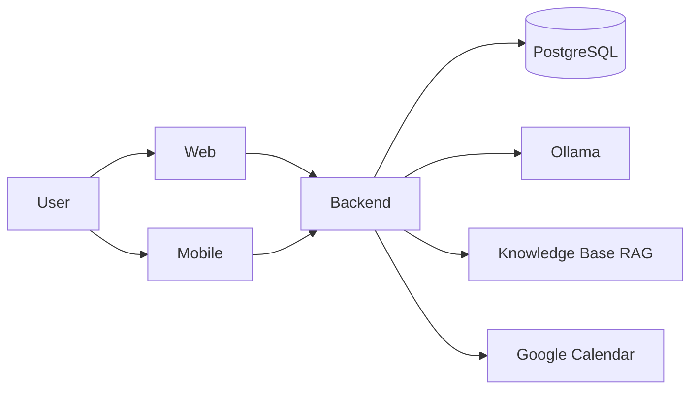


# Delvo

Delvo is an AI-first productivity assistant for planning work, tracking tasks, organizing meetings, and centralizing notes.

It is built as a monorepo with a web client, backend API, mobile app scaffold, and an assistant layer powered by Ollama + RAG.

## Why Delvo

Delvo is designed to combine two experiences in one product:
- Structured planner operations (tasks, meetings, events, notes).
- Natural-language interaction through an assistant that can understand intent and execute actions.

This allows users to work in two modes:
- Direct manipulation in UI (forms, lists, calendar views).
- Conversational mode in chat for faster productivity workflows.

---

## Tech Stack


---

## Core Capabilities

### Authentication
- Register and login with JWT.
- HTTP-only cookie session in web layer.

### Planner
- Tasks: create, list, update, delete.
- Meetings: create, list, update, delete.
- Events: create, list, update, delete.
- Notes: backend CRUD integrated in planner endpoints.

### Assistant
- Chat endpoint with intent-based execution.
- JSON-first output contract from LLM.
- RAG support from local knowledge files (`backend/knowledge`).

### Platform
- Web app with dashboard + chat.
- Mobile app scaffold (Expo) ready for product integration.
- Dockerized local environment.

---

## Architecture



---

## Repository Structure

```text
delvo/
├── backend/
│   ├── app/
│   │   ├── api/
│   │   ├── core/
│   │   ├── db/postgresql/
│   │   └── services/
│   ├── knowledge/
│   ├── prompt_system.txt
│   └── main.py
├── web/
│   ├── app/
│   ├── components/
│   └── lib/
├── mobile/
├── docs/
└── docker-compose.yml
```
---

## Quick Start

### Option A: Docker (recommended)

```bash
docker compose up --build
```

Services:
- Web: `http://localhost:31667`
- Backend API: `http://localhost:30667`
- PostgreSQL: `localhost:5432`

Health checks:
- `GET http://localhost:30667/health`
- `GET http://localhost:31667/api/health`

### Option B: Local development

Backend:

```bash
cd backend
pip install -r requirements.txt
uvicorn main:app --reload --host 0.0.0.0 --port 8000
```

Web:

```bash
cd web
pnpm install
pnpm run dev
```

Mobile:

```bash
cd mobile
npm ci
npm run start
```

---

## Environment Variables

Project configuration is loaded from `.env`.

Main variables:
- `POSTGRES_HOST`, `POSTGRES_PORT`, `POSTGRES_USER`, `POSTGRES_PASSWORD`, `POSTGRES_DATABASE`
- `JWT_SECRET_KEY`, `JWT_ALGORITHM`, `JWT_EXPIRE_MINUTES`
- `DELVO_BACKEND_URL`, `DELVO_AUTH_COOKIE_NAME`, `DELVO_AUTH_COOKIE_MAX_AGE`
- `OLLAMA_URL`, `LLM_MODEL`, `EMBED_MODEL`
- `PROMPT_PATH`, `PROMPT_PATH_EN`

---

## API Overview

Base prefixes:
- `/api/v1/auth`
- `/api/v1/planner`
- `/api/v1/assistant`

Representative endpoints:
- `POST /api/v1/auth/register`
- `POST /api/v1/auth/login`
- `GET|POST|PUT|DELETE /api/v1/planner/tasks`
- `GET|POST|PUT|DELETE /api/v1/planner/meetings`
- `GET|POST|PUT|DELETE /api/v1/planner/events`
- `GET|POST|PUT|DELETE /api/v1/planner/notes`
- `POST /api/v1/assistant/chat`
- `POST /api/v1/assistant/reindex`

---

## AI and RAG

- Assistant responses are normalized to a strict JSON format.
- RAG chunks are loaded from `backend/knowledge/*.md` and `*.txt`.
- Reindex endpoint:

```http
POST /api/v1/assistant/reindex
```

---

## Suggested Demo Flow

1. Register a new user and login.
2. Create 2-3 tasks and one meeting.
3. Open chat and ask the assistant to list or update those items.
4. Create a note from planner endpoints.
5. Trigger reindex and ask a knowledge-based question.

---

## Current Status

Delvo is actively moving toward a Notion-style MVP:
- Backend planner and assistant are operational.
- Web includes chat and dashboard flows.
- Notes backend is integrated and ready for frontend expansion.
- Mobile remains scaffolded and pending product-level features.
