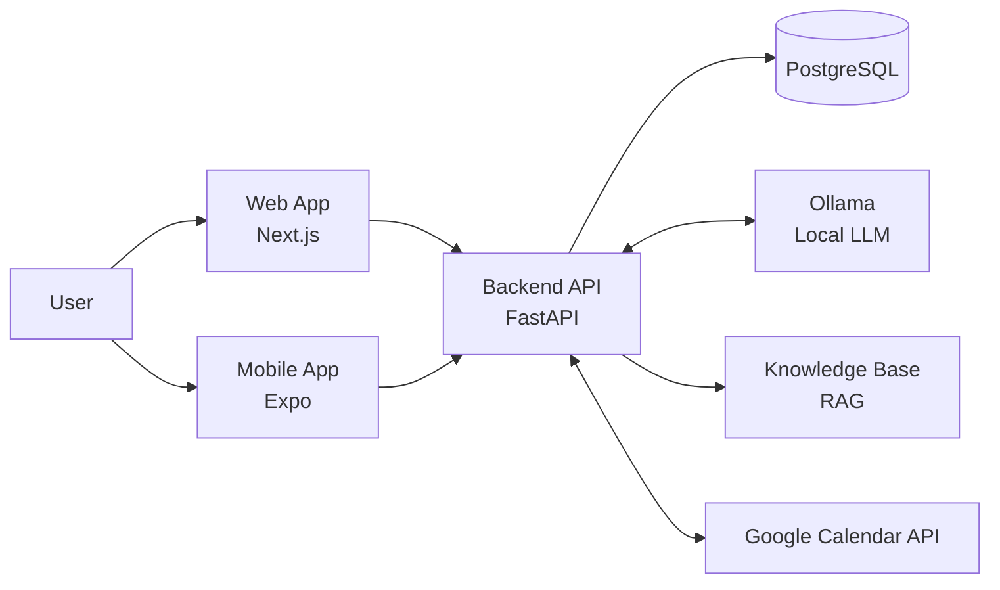

# Delvo

Delvo is an AI-first personal productivity assistant that combines a structured planner with a natural-language chat interface. Users can manage tasks, meetings, events, and notes either through direct UI interactions or by talking to the assistant in plain language.

It ships as a monorepo with a FastAPI backend, a Next.js web app, and an Expo mobile app — all deployed with Docker.

---

## Tech Stack


| Layer | Technology |
|---|---|
| Backend API | Python 3.12, FastAPI, Uvicorn |
| Database | PostgreSQL 16 |
| Auth | JWT (access + refresh tokens), HTTP-only cookies (web) |
| AI/LLM | Ollama (local), LLaMA / Mistral models |
| RAG | Custom chunker + in-process vector search |
| Web | Next.js 15 App Router, TypeScript, Tailwind CSS, shadcn/ui |
| Mobile | Expo (React Native), TypeScript |
| Deployment | Docker Compose, Cloudflare Tunnel |

---

## Features

### Authentication
- Register and log in with email/password.
- JWT access + refresh tokens with automatic silent renewal.
- HTTP-only cookie sessions on the web (no tokens exposed to JS).
- Google OAuth 2.0 integration — connect your Google account to enable Google Calendar sync.

### Planner
Full CRUD for four entity types:

| Entity | Fields |
|---|---|
| Task | title, description, due date/time, priority (low/medium/high), status (pending/in_progress/done) |
| Meeting | title, description, date, time, duration, location, participants list, status |
| Event | title, description, date, time, location, event type |
| Note | title, content, status (active/archived) |

### Google Calendar Integration
- **Connect** your Google account via OAuth 2.0 from the Settings screen or web Settings page.
- **Import on connect**: when you link your account, events from the past 30 days and the next 180 days are imported into Delvo automatically.
- **Bidirectional sync**: creating a Delvo event also pushes it to your Google Calendar (best-effort — the local event is always saved even if the push fails).
- **Edit Google events**: edit any Google Calendar event directly from the Delvo mobile calendar view. Changes are pushed to Google via PATCH.
- Deduplication: a unique `gcal_event_id` per user prevents the same Google event from being imported twice.
- Token auto-refresh: expired Google access tokens are silently refreshed using the stored refresh token.

### AI Assistant
- Chat with the assistant in Spanish or English.
- Intent detection: the LLM identifies what the user wants (create task, list meetings, search knowledge, etc.) and returns structured JSON.
- Action execution: detected intents are fulfilled by calling the same planner CRUD functions that the UI uses.
- RAG: assistant answers are grounded in a knowledge base of local Markdown/text files (`backend/knowledge/`). The knowledge base can be reindexed at any time.
- Conversation history: multi-turn context is passed per request.

### Web App
- Dashboard showing today's tasks, upcoming meetings, and recent notes.
- Full planner screens for tasks, meetings, events, and notes.
- Chat interface connected to the AI assistant.
- Settings page to manage Google Calendar connection.
- Bilingual routing (`/es/...`, `/en/...`) with automatic language detection from `Accept-Language`.
- Middleware-based auth guard: unauthenticated users are redirected to login; authenticated users are redirected away from login/signup.

### Mobile App (Expo)
- Calendar view combining Delvo tasks, events, meetings, and live Google Calendar events.
- Inline editing for all entry types including Google Calendar events.
- Settings screen with Google Calendar connect/disconnect flow (using `WebBrowser.openAuthSessionAsync`).
- AI assistant chat screen.
- JWT token storage in `SecureStore` with automatic silent refresh.

---

## Architecture



### Request flow — web

```
Browser → Next.js middleware (auth check) → Next.js page/API route → FastAPI backend → PostgreSQL
```

The web app's Next.js server proxies authenticated API calls so the JWT never leaves the server-side cookie.

### Request flow — mobile

```
Expo App → FastAPI backend (Bearer token) → PostgreSQL / Google Calendar API
```

The mobile app stores tokens in `SecureStore` and attaches `Authorization: Bearer <token>` to every request. On 401, it silently attempts a token refresh before retrying.

---

## Repository Structure

```text
delvo/
├── backend/
│   ├── app/
│   │   ├── api/
│   │   │   └── v1/
│   │   │       └── endpoints/
│   │   │           ├── auth.py           # Register, login, refresh, /me
│   │   │           ├── planner.py        # Tasks, meetings, events, notes CRUD
│   │   │           ├── assistant.py      # Chat endpoint + reindex
│   │   │           └── google_calendar.py# OAuth connect/callback, sync, events CRUD
│   │   ├── core/
│   │   │   └── security.py              # JWT encode/decode
│   │   ├── db/
│   │   │   └── postgresql/
│   │   │       ├── connector.py         # Connection pool + cursor helper
│   │   │       ├── planner_repository.py# Table migrations (run on startup)
│   │   │       ├── task_repository.py
│   │   │       ├── event_repository.py
│   │   │       ├── meeting_repository.py
│   │   │       ├── notes_repository.py
│   │   │       └── user_repository.py
│   │   └── services/
│   │       ├── assistant_service.py     # LLM chat + RAG retrieval
│   │       └── google_calendar_service.py# Google API client + sync logic
│   ├── knowledge/                       # RAG source files (.md, .txt)
│   ├── prompt_system.txt                # System prompt in Spanish
│   ├── prompt_system_en.txt             # System prompt in English
│   ├── requirements.txt
│   ├── Dockerfile
│   └── main.py                          # FastAPI app + lifespan startup
├── web/
│   ├── app/
│   │   ├── (app)/
│   │   │   └── [language]/             # Bilingual route group
│   │   │       ├── home/               # Dashboard
│   │   │       ├── tasks/
│   │   │       ├── meetings/
│   │   │       ├── events/
│   │   │       ├── notes/
│   │   │       ├── assistant/          # Chat UI
│   │   │       ├── settings/           # Google Calendar connect
│   │   │       └── calendar/
│   │   ├── oauth-done/                 # Post-OAuth landing (mobile flow)
│   │   └── privacy-policy/             # Public privacy policy
│   ├── components/
│   ├── lib/
│   │   └── language.ts                 # Language detection + routing
│   ├── proxy.ts                        # Auth middleware
│   └── Dockerfile
├── mobile/
│   └── src/
│       ├── screens/
│       │   ├── CalendarScreen.tsx      # Unified calendar + gcal events
│       │   ├── SettingsScreen.tsx      # Google Calendar OAuth
│       │   ├── AssistantScreen.tsx     # Chat
│       │   └── ...
│       ├── api/
│       │   └── client.ts              # Typed API client + token refresh
│       └── context/
│           └── AuthContext.tsx         # Token storage + session management
├── docker-compose.yml
└── .env
```

---

## Quick Start

### Prerequisites

- Docker and Docker Compose
- An Ollama instance accessible from the backend container (or `host.docker.internal`)
- A `.env` file at the repo root (see [Environment Variables](#environment-variables))

### Option A: Docker (recommended)

```bash
cp .env.example .env   # fill in your values
docker compose up --build
```

Services after startup:

| Service | URL |
|---|---|
| Web app | http://localhost:31667 |
| Backend API | http://localhost:30667 |
| PostgreSQL | localhost:55432 |

Health check endpoints:
```
GET http://localhost:30667/health
GET http://localhost:31667/api/health
```

### Option B: Local development

**Backend:**
```bash
cd backend
pip install -r requirements.txt
uvicorn main:app --reload --host 0.0.0.0 --port 8000
```

**Web:**
```bash
cd web
pnpm install
pnpm run dev
```

**Mobile:**
```bash
cd mobile
npm install
npx expo start
```

The mobile app connects to `https://apidelvo.gromber05.dev` by default. Change `BASE_URL` in `mobile/src/api/client.ts` for local development.

---

## Environment Variables

Create a `.env` file in the repo root with the following variables:

### Database
| Variable | Default | Description |
|---|---|---|
| `POSTGRES_HOST` | `postgres` | PostgreSQL hostname (service name inside Docker) |
| `POSTGRES_PORT` | `5432` | PostgreSQL port |
| `POSTGRES_USER` | `delvo` | Database user |
| `POSTGRES_PASSWORD` | — | Database password |
| `POSTGRES_DATABASE` | `delvo` | Database name |

### Auth / JWT
| Variable | Default | Description |
|---|---|---|
| `JWT_SECRET_KEY` | — | Secret used to sign JWTs (also used for OAuth state tokens) |
| `JWT_ALGORITHM` | `HS256` | JWT signing algorithm |
| `JWT_EXPIRE_MINUTES` | `60` | Access token lifetime in minutes |
| `JWT_REFRESH_EXPIRE_DAYS` | `30` | Refresh token lifetime in days |

### Web app
| Variable | Default | Description |
|---|---|---|
| `DELVO_BACKEND_URL` | `http://backend:8000` | Backend URL as seen by the Next.js server |
| `DELVO_AUTH_COOKIE_NAME` | `session_token` | Name of the HTTP-only auth cookie |
| `DELVO_AUTH_COOKIE_MAX_AGE` | — | Cookie max-age in seconds |
| `DELVO_PROXY_BYPASS` | `false` | Set to `true` to skip all auth middleware (dev only) |

### AI / Ollama
| Variable | Default | Description |
|---|---|---|
| `OLLAMA_URL` | `http://host.docker.internal:11434` | Ollama server URL |
| `LLM_MODEL` | — | Chat model name (e.g. `llama3.2`, `mistral`) |
| `EMBED_MODEL` | — | Embedding model name (e.g. `nomic-embed-text`) |
| `PROMPT_PATH` | `prompt_system.txt` | Path to the Spanish system prompt |
| `PROMPT_PATH_EN` | `prompt_system_en.txt` | Path to the English system prompt |

### Google Calendar OAuth
| Variable | Default | Description |
|---|---|---|
| `GOOGLE_CLIENT_ID` | — | OAuth 2.0 client ID from Google Cloud Console |
| `GOOGLE_CLIENT_SECRET` | — | OAuth 2.0 client secret |
| `GOOGLE_CALLBACK_URL` | `https://apidelvo.gromber05.dev/api/v1/google-calendar/callback` | Must match an authorized redirect URI in Google Cloud Console |

---

## API Reference

Base URL: `https://apidelvo.gromber05.dev` (or `http://localhost:30667` locally)

All endpoints except auth require `Authorization: Bearer <access_token>`.

### Auth — `/api/v1/auth`

| Method | Path | Description |
|---|---|---|
| `POST` | `/register` | Create a new account |
| `POST` | `/login` | Log in, returns access + refresh tokens |
| `POST` | `/refresh` | Exchange a refresh token for a new access token |
| `GET` | `/me` | Return the current user's profile |
| `PUT` | `/me/google-calendar` | Save Google OAuth tokens to the user record |

**Register / Login request body:**
```json
{
  "email": "user@example.com",
  "password": "secret",
  "name": "Jane"
}
```

**Auth response:**
```json
{
  "access_token": "...",
  "refresh_token": "...",
  "token_type": "bearer",
  "user": { "id": 1, "name": "Jane", "email": "user@example.com" }
}
```

---

### Planner — `/api/v1/planner`

#### Tasks

| Method | Path | Description |
|---|---|---|
| `GET` | `/tasks` | List all tasks for the current user |
| `POST` | `/tasks` | Create a task |
| `GET` | `/tasks/{id}` | Get a single task |
| `PUT` | `/tasks/{id}` | Update a task |
| `DELETE` | `/tasks/{id}` | Delete a task |

**Task body:**
```json
{
  "title": "Prepare slides",
  "description": "For the Monday standup",
  "due_date": "2025-06-01",
  "due_time": "09:00:00",
  "priority": "high",
  "status": "pending"
}
```

`priority`: `low` | `medium` | `high`  
`status`: `pending` | `in_progress` | `done`

#### Meetings

| Method | Path | Description |
|---|---|---|
| `GET` | `/meetings` | List all meetings |
| `POST` | `/meetings` | Create a meeting |
| `GET` | `/meetings/{id}` | Get a single meeting |
| `PUT` | `/meetings/{id}` | Update a meeting |
| `DELETE` | `/meetings/{id}` | Delete a meeting |

**Meeting body:**
```json
{
  "title": "Sprint planning",
  "meeting_date": "2025-06-02",
  "meeting_time": "10:00:00",
  "duration_minutes": 60,
  "location": "Zoom",
  "participants": ["alice@example.com", "bob@example.com"],
  "status": "scheduled"
}
```

`status`: `scheduled` | `completed` | `cancelled`

#### Events

| Method | Path | Description |
|---|---|---|
| `GET` | `/events` | List all events |
| `POST` | `/events` | Create an event (also pushes to Google Calendar if connected) |
| `GET` | `/events/{id}` | Get a single event |
| `PUT` | `/events/{id}` | Update an event |
| `DELETE` | `/events/{id}` | Delete an event |

**Event body:**
```json
{
  "title": "Team offsite",
  "event_date": "2025-07-10",
  "event_time": "08:00:00",
  "description": "Annual team retreat",
  "location": "Barcelona",
  "event_type": "general"
}
```

#### Notes

| Method | Path | Description |
|---|---|---|
| `GET` | `/notes` | List all notes |
| `POST` | `/notes` | Create a note |
| `GET` | `/notes/{id}` | Get a single note |
| `PUT` | `/notes/{id}` | Update a note |
| `DELETE` | `/notes/{id}` | Delete a note |

**Note body:**
```json
{
  "title": "Ideas for Q3",
  "content": "...",
  "status": "active"
}
```

`status`: `active` | `archived`

---

### AI Assistant — `/api/v1/assistant`

| Method | Path | Description |
|---|---|---|
| `POST` | `/chat` | Send a message and get an intent-driven response |
| `POST` | `/reindex` | Reindex the RAG knowledge base from `backend/knowledge/` |

**Chat request:**
```json
{
  "message": "Create a task called 'Review PR' due tomorrow",
  "history": [
    { "role": "user", "content": "Hello" },
    { "role": "assistant", "content": "Hi! How can I help?" }
  ],
  "use_rag": true,
  "language": "es"
}
```

**Chat response:**
```json
{
  "intent": "create_task",
  "data": { "title": "Review PR", "due_date": "2025-05-22" },
  "message": "He creado la tarea 'Review PR' para mañana.",
  "context_used": ["knowledge chunk 1", "..."]
}
```

---

### Google Calendar — `/api/v1/google-calendar`

| Method | Path | Description |
|---|---|---|
| `GET` | `/connect` | Returns a Google OAuth URL to open in a browser |
| `GET` | `/callback` | OAuth callback — exchanges code, saves tokens, redirects |
| `POST` | `/sync` | Import Google Calendar events into Delvo (past 30 days → next 180 days) |
| `GET` | `/events` | List events from Google Calendar |
| `POST` | `/events` | Create an event directly in Google Calendar |
| `PUT` | `/events/{id}` | Full-replace a Google Calendar event |
| `PATCH` | `/events/{id}` | Partially update a Google Calendar event |
| `DELETE` | `/events/{id}` | Delete a Google Calendar event |

**List events query params:**
```
time_min=2025-01-01T00:00:00Z
time_max=2025-12-31T23:59:59Z
max_results=50
```

**PATCH event body (all fields optional):**
```json
{
  "summary": "Updated title",
  "description": "New description",
  "location": "Madrid",
  "start": { "dateTime": "2025-06-01T10:00:00Z", "timeZone": "UTC" },
  "end":   { "dateTime": "2025-06-01T11:00:00Z", "timeZone": "UTC" }
}
```

---

## Google Calendar Setup

To enable Google Calendar integration you need a Google Cloud project with the Calendar API enabled.

1. Go to [Google Cloud Console](https://console.cloud.google.com/) → **APIs & Services** → **Credentials**.
2. Create an **OAuth 2.0 Client ID** of type **Web application**.
3. Add your callback URL to **Authorized redirect URIs**:
   ```
   https://apidelvo.gromber05.dev/api/v1/google-calendar/callback
   ```
4. Copy the **Client ID** and **Client Secret** into your `.env`:
   ```
   GOOGLE_CLIENT_ID=...
   GOOGLE_CLIENT_SECRET=...
   ```
5. Enable the **Google Calendar API** and the **People API** in **APIs & Services** → **Library**.
6. Add your Google account as a **Test user** under **OAuth consent screen** → **Test users** (required while the app is unverified).

---

## AI / RAG Setup

Delvo uses [Ollama](https://ollama.com) for local inference — no external API calls or costs.

**Pull the models you want:**
```bash
ollama pull llama3.2          # or mistral, llama3.1, etc.
ollama pull nomic-embed-text  # for RAG embeddings
```

**Configure in `.env`:**
```
OLLAMA_URL=http://host.docker.internal:11434
LLM_MODEL=llama3.2
EMBED_MODEL=nomic-embed-text
```

**Add knowledge to the RAG:**

Drop `.md` or `.txt` files into `backend/knowledge/`. After adding files, trigger a reindex:
```bash
curl -X POST http://localhost:30667/api/v1/assistant/reindex \
  -H "Authorization: Bearer <token>"
```

The assistant will use the knowledge base to ground its answers on the next chat request.

---

## Deployment

The production deployment uses **Cloudflare Tunnel** (`cloudflared`) to expose the backend and web app without opening inbound ports.

Services are mapped:
- `apidelvo.gromber05.dev` → backend container port 8000
- `delvo.gromber05.dev` → web container port 3000

See `docker-compose.yml` for the full service configuration.

---

## Demo Flow

1. Register a new account and log in.
2. Create a few tasks with different priorities and due dates.
3. Schedule a meeting with participants.
4. Go to Settings and connect your Google account — your existing Google Calendar events will be imported automatically.
5. Create a new Delvo event — it will appear in your Google Calendar within seconds.
6. Open the mobile Calendar screen and edit a Google Calendar event directly from Delvo.
7. Open the chat and ask the assistant in natural language:
   - *"¿Cuáles son mis tareas pendientes?"*
   - *"Crea una reunión para el viernes a las 10"*
   - *"Muéstrame mis eventos de esta semana"*

---

## Current Status

Delvo is in active development. The following are fully operational:

- [x] Backend: auth, full planner CRUD, AI assistant, Google Calendar bidirectional sync
- [x] Web: dashboard, planner screens, chat, settings, bilingual routing
- [x] Mobile: calendar view (Delvo + Google), chat, settings, Google Calendar editing
- [x] Google OAuth + token auto-refresh on both web and mobile
- [x] RAG knowledge base with reindex support
- [ ] Push notifications
- [ ] Recurring events
- [ ] Collaborative / shared workspaces
