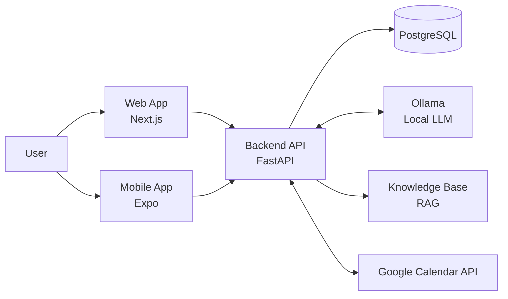

<div align="center">
  
  <h1>Delvo</h1>
  <p>AI-first personal productivity assistant — manage tasks, meetings, events and notes through a structured planner or by chatting in plain language.</p>
  <a href="https://deepwiki.com/gromber05/delvo">See Deepwiki</a>

  <p>
    
    
    
    
    
    
    
    
    
  </p>
</div>

---

## Overview

Delvo ships as a monorepo with three layers:

| Layer | Technology |
|---|---|
| **Backend API** | Python 3.12, FastAPI, Uvicorn |
| **Database** | PostgreSQL 16 |
| **Auth** | JWT (access + refresh tokens), HTTP-only cookies (web) |
| **AI / LLM** | Ollama (local) — LLaMA / Mistral / Qwen models |
| **RAG** | Custom chunker + in-process vector search |
| **Web** | Next.js 15 App Router, TypeScript, Tailwind CSS, shadcn/ui |
| **Mobile** | Expo (React Native), TypeScript |
| **Deployment** | Docker Compose, Cloudflare Tunnel |

---

## Features

### 🔐 Authentication
- Register and log in with email/password
- JWT access + refresh tokens with automatic silent renewal
- HTTP-only cookie sessions on the web (no tokens exposed to JS)
- Google OAuth 2.0 — connect your Google account to enable Calendar sync

### 📋 Planner
Full CRUD for four entity types:

| Entity | Fields |
|---|---|
| **Task** | title, description, due date/time, priority (low/medium/high), status (pending/in_progress/done) |
| **Meeting** | title, description, date, time, duration, location, participants, status |
| **Event** | title, description, date, time, location, event type |
| **Note** | title, content, status (active/archived) |

### 📅 Google Calendar Integration
- **Connect** via OAuth 2.0 from Settings (web or mobile)
- **Import on connect** — events from the past 30 days and next 180 days are pulled in automatically
- **Bidirectional sync** — creating a Delvo event pushes it to Google Calendar in real time
- **Edit Google events** directly from the Delvo mobile calendar view (PATCH)
- Deduplication via `gcal_event_id` — no duplicate imports
- Token auto-refresh — expired Google tokens are silently renewed

### 🤖 AI Assistant (Stella)
- Chat in Spanish or English
- Intent detection — the LLM classifies the request and returns structured JSON
- Action execution — detected intents call the same CRUD functions the UI uses
- RAG — answers grounded in a local Markdown/text knowledge base (`backend/knowledge/`)
- Voice input — record audio; transcribed via local STT (wav, mp3, m4a, flac, ogg, webm, aac)
- Conversation history persisted per user, accessible across devices
- Sentiment analysis on every incoming message

### 🔔 Push Notifications
- Automatic notification on task, event, meeting and note creation
- Configurable in Settings: Stella alerts, task reminders, lead time

### 🛡️ Admin Panel
- Role-based access control (`user` / `admin`)
- Global stats: users, conversations, message volume
- User management: list all users, update roles
- Conversation inspector: admins can read any user's full chat history

---

## Architecture



### Request flow — web
```
Browser → Next.js middleware (auth check) → Next.js page/API route → FastAPI backend → PostgreSQL
```
The Next.js server proxies authenticated API calls so the JWT never leaves the server-side cookie.

### Request flow — mobile
```
Expo App → FastAPI backend (Bearer token) → PostgreSQL / Google Calendar API
```
The mobile app stores tokens in `SecureStore` and attaches `Authorization: Bearer <token>` to every request. On 401, it silently refreshes before retrying.

---

## Repository Structure

```
delvo/
├── backend/
│   ├── app/
│   │   ├── api/v1/endpoints/
│   │   │   ├── auth.py                # Register, login, refresh, /me
│   │   │   ├── planner.py             # Tasks, meetings, events, notes CRUD
│   │   │   ├── assistant.py           # Chat endpoint + reindex
│   │   │   └── google_calendar.py     # OAuth connect/callback, sync, events CRUD
│   │   ├── core/security.py           # JWT encode/decode
│   │   ├── db/
│   │   │   ├── models.py              # SQLAlchemy ORM models
│   │   │   └── postgresql/            # Repositories (task, event, meeting, note, user, conversation)
│   │   └── services/
│   │       ├── ai_service.py          # Ollama LLM client
│   │       ├── assistant_service.py   # Intent dispatch + RAG retrieval
│   │       └── google_calendar_service.py
│   ├── knowledge/                     # RAG source files (.md, .txt)
│   ├── tests/                         # Unit + integration test suite
│   ├── prompt_system.txt              # System prompt (Spanish)
│   ├── prompt_system_en.txt           # System prompt (English)
│   ├── requirements.txt
│   └── Dockerfile
├── web/
│   ├── app/(app)/[language]/          # Bilingual route group (es / en)
│   │   ├── home/                      # Dashboard
│   │   ├── tasks/ meetings/ events/ notes/
│   │   ├── assistant/                 # Chat UI
│   │   ├── settings/                  # Profile + Google Calendar
│   │   └── calendar/
│   ├── app/api/                       # Next.js proxy routes (auth, assistant, conversations)
│   └── Dockerfile
├── mobile/src/
│   ├── screens/
│   │   ├── PlannerScreen.tsx          # Monthly calendar + CRUD
│   │   ├── CalendarScreen.tsx         # Unified calendar + Google events
│   │   ├── ChatScreen.tsx             # Stella AI chat
│   │   ├── CreateScreen.tsx           # Quick-create entry point
│   │   ├── SettingsScreen.tsx         # Google Calendar OAuth + preferences
│   │   ├── HomeScreen.tsx             # Dashboard
│   │   ├── PersonalInfoScreen.tsx
│   │   └── SecurityScreen.tsx
│   ├── api/client.ts                  # Typed API client + token refresh
│   └── context/AuthContext.tsx        # Token storage + session management
├── docker-compose.yml
└── .env
```

---

## Quick Start

### Prerequisites
- Docker and Docker Compose
- An Ollama instance (local or `host.docker.internal`)
- A `.env` file at the repo root (see [Environment Variables](#environment-variables))

### Option A — Docker (recommended)

```bash
cp .env.example .env   # fill in your values
docker compose up --build
```

| Service | URL |
|---|---|
| Web app | http://localhost:31667 |
| Backend API | http://localhost:30667 |
| PostgreSQL | localhost:55432 |

```bash
# Health checks
curl http://localhost:30667/health
curl http://localhost:31667/api/health
```

### Option B — Local development

```bash
# Backend
cd backend
pip install -r requirements.txt
uvicorn main:app --reload --host 0.0.0.0 --port 8000

# Web
cd web
pnpm install && pnpm dev

# Mobile
cd mobile
npm install && npx expo start
```

> The mobile app points to `https://apidelvo.gromber05.dev` by default. Change `BASE_URL` in `mobile/src/api/client.ts` for local dev.

---

## Environment Variables

### Database
| Variable | Default | Description |
|---|---|---|
| `POSTGRES_HOST` | `postgres` | PostgreSQL hostname |
| `POSTGRES_PORT` | `5432` | PostgreSQL port |
| `POSTGRES_USER` | `delvo` | Database user |
| `POSTGRES_PASSWORD` | — | Database password |
| `POSTGRES_DATABASE` | `delvo` | Database name |

### Auth / JWT
| Variable | Default | Description |
|---|---|---|
| `JWT_SECRET_KEY` | — | Secret used to sign JWTs |
| `JWT_ALGORITHM` | `HS256` | Signing algorithm |
| `JWT_EXPIRE_MINUTES` | `60` | Access token lifetime |
| `JWT_REFRESH_EXPIRE_DAYS` | `30` | Refresh token lifetime |

### Web app
| Variable | Default | Description |
|---|---|---|
| `DELVO_BACKEND_URL` | `http://backend:8000` | Backend URL (server-side) |
| `DELVO_AUTH_COOKIE_NAME` | `session_token` | HTTP-only auth cookie name |
| `DELVO_AUTH_COOKIE_MAX_AGE` | — | Cookie max-age in seconds |
| `DELVO_PROXY_BYPASS` | `false` | Skip auth middleware (dev only) |

### AI / Ollama
| Variable | Default | Description |
|---|---|---|
| `OLLAMA_URL` | `http://host.docker.internal:11434` | Ollama server URL |
| `LLM_MODEL` | — | Chat model (e.g. `qwen2.5:7b`, `llama3.2`) |
| `EMBED_MODEL` | — | Embedding model (e.g. `nomic-embed-text`) |
| `PROMPT_PATH` | `prompt_system.txt` | Spanish system prompt path |
| `PROMPT_PATH_EN` | `prompt_system_en.txt` | English system prompt path |

### Google Calendar OAuth
| Variable | Default | Description |
|---|---|---|
| `GOOGLE_CLIENT_ID` | — | OAuth 2.0 client ID |
| `GOOGLE_CLIENT_SECRET` | — | OAuth 2.0 client secret |
| `GOOGLE_CALLBACK_URL` | `https://apidelvo.gromber05.dev/api/v1/google-calendar/callback` | Authorized redirect URI |

---

## API Reference

**Base URL:** `https://apidelvo.gromber05.dev` (or `http://localhost:30667` locally)

All endpoints except auth require `Authorization: Bearer <access_token>`.

### Auth — `/api/v1/auth`

| Method | Path | Description |
|---|---|---|
| `POST` | `/register` | Create a new account |
| `POST` | `/login` | Log in, returns access + refresh tokens |
| `POST` | `/refresh` | Exchange refresh token for a new access token |
| `GET` | `/me` | Return current user's profile |
| `PUT` | `/me/google-calendar` | Save Google OAuth tokens |

```json
// Register / Login body
{ "email": "user@example.com", "password": "secret", "name": "Jane" }

// Response
{ "access_token": "...", "refresh_token": "...", "token_type": "bearer",
  "user": { "id": 1, "name": "Jane", "email": "user@example.com" } }
```

### Planner — `/api/v1/planner`

| Method | Path | Description |
|---|---|---|
| `GET / POST` | `/tasks` | List / create tasks |
| `GET / PUT / DELETE` | `/tasks/{id}` | Read / update / delete task |
| `GET / POST` | `/meetings` | List / create meetings |
| `GET / PUT / DELETE` | `/meetings/{id}` | Read / update / delete meeting |
| `GET / POST` | `/events` | List / create events |
| `GET / PUT / DELETE` | `/events/{id}` | Read / update / delete event |
| `GET / POST` | `/notes` | List / create notes |
| `GET / PUT / DELETE` | `/notes/{id}` | Read / update / delete note |

### AI Assistant — `/api/v1/assistant`

| Method | Path | Description |
|---|---|---|
| `POST` | `/chat` | Send a message, get an intent-driven response |
| `POST` | `/reindex` | Rebuild the RAG index from `backend/knowledge/` |

```json
// Request
{ "message": "Crea una tarea 'Revisar PR' para mañana",
  "history": [], "use_rag": true, "language": "es" }

// Response
{ "intent": "create_task",
  "data": { "title": "Revisar PR", "due_date": "2025-06-01" },
  "message": "He creado la tarea 'Revisar PR' para mañana.",
  "context_used": [] }
```

### Conversations — `/api/v1/conversations`

| Method | Path | Description |
|---|---|---|
| `GET` | `/` | List all conversations |
| `GET` | `/{id}` | Get a conversation with messages |
| `DELETE` | `/{id}` | Delete a conversation |

### Admin — `/api/v1/admin` *(admin role required)*

| Method | Path | Description |
|---|---|---|
| `GET` | `/stats` | Global stats (users, conversations, messages) |
| `GET` | `/users` | List all users |
| `PUT` | `/users/{id}/role` | Update a user's role |
| `GET` | `/conversations` | List all conversations |
| `GET` | `/conversations/{id}/messages` | Inspect a conversation |

### Google Calendar — `/api/v1/google-calendar`

| Method | Path | Description |
|---|---|---|
| `GET` | `/connect` | Returns Google OAuth URL |
| `GET` | `/callback` | OAuth callback — exchanges code, saves tokens |
| `POST` | `/sync` | Import events (past 30 days → next 180 days) |
| `GET / POST` | `/events` | List / create Google Calendar events |
| `PUT / PATCH / DELETE` | `/events/{id}` | Update / delete Google Calendar event |

---

## Google Calendar Setup

1. Go to [Google Cloud Console](https://console.cloud.google.com/) → **APIs & Services** → **Credentials**
2. Create an **OAuth 2.0 Client ID** (type: Web application)
3. Add your callback URL to **Authorized redirect URIs**:
   ```
   https://apidelvo.gromber05.dev/api/v1/google-calendar/callback
   ```
4. Copy credentials to `.env`:
   ```
   GOOGLE_CLIENT_ID=...
   GOOGLE_CLIENT_SECRET=...
   ```
5. Enable **Google Calendar API** and **People API** in **APIs & Services → Library**
6. Add your Google account as a **Test user** under **OAuth consent screen → Test users**

---

## AI / RAG Setup

Delvo uses [Ollama](https://ollama.com) for local inference — no external API calls, no costs.

```bash
# Pull the models
ollama pull qwen2.5:7b        # or llama3.2, mistral, etc.
ollama pull nomic-embed-text  # for RAG embeddings

# Configure in .env
OLLAMA_URL=http://host.docker.internal:11434
LLM_MODEL=qwen2.5:7b
EMBED_MODEL=nomic-embed-text
```

**Add knowledge to the RAG:** drop `.md` or `.txt` files into `backend/knowledge/`, then reindex:

```bash
curl -X POST http://localhost:30667/api/v1/assistant/reindex \
  -H "Authorization: Bearer <token>"
```

---

## Testing

```bash
cd backend
pip install -r requirements-test.txt
pytest
```

No live database required — the DB init step is patched out by `conftest.py`.

| File | Type | Coverage |
|---|---|---|
| `test_integration_health.py` | Integration | `GET /health` and basic routes |
| `test_integration_auth.py` | Integration | Register, login, refresh, `/me` |
| `test_integration_chat.py` | Integration | AI assistant chat endpoint |
| `test_integration_planner.py` | Integration | Tasks, events, meetings, notes CRUD |
| `test_unit_models.py` | Unit | SQLAlchemy ORM model properties |
| `test_unit_schemas.py` | Unit | Pydantic request/response schemas |
| `test_unit_security.py` | Unit | Password hashing + JWT |
| `test_unit_sentiment.py` | Unit | Sentiment classification |

---

## Deployment

Production runs on **Cloudflare Tunnel** — no inbound ports needed.

| Tunnel | Target |
|---|---|
| `apidelvo.gromber05.dev` | Backend container port 8000 |
| `delvo.gromber05.dev` | Web container port 3000 |

```bash
docker compose up --build -d
```

---

## Current Status

- [x] Backend: auth, full planner CRUD, AI assistant, Google Calendar bidirectional sync
- [x] Backend: conversation persistence (per user, accessible across devices)
- [x] Backend: admin panel (stats, user management, conversation access)
- [x] Backend: full test suite (unit + integration, no live DB required)
- [x] Web: dashboard, planner, chat, settings, bilingual routing (`/es/...` / `/en/...`)
- [x] Mobile: calendar, chat with voice input, settings, Google Calendar editing
- [x] Push notifications (Expo)
- [x] RAG knowledge base with on-demand reindex
- [ ] Recurring events
- [ ] Collaborative / shared workspaces
