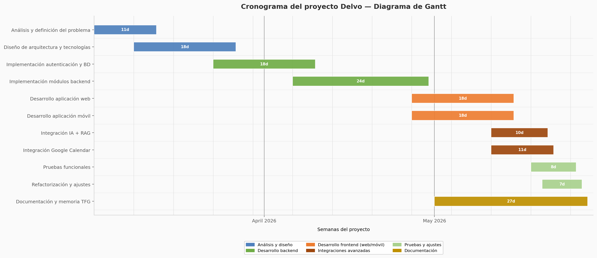

# 1. Índice del documento

2. [Introducción](#2-introducción)
   * [a. Justificación del proyecto: cómo se originó la idea](#a-justificación-del-proyecto-cómo-se-originó-la-idea)
   * [b. Análisis comparativo de aplicaciones similares](#b-análisis-comparativo-de-aplicaciones-similares)
   * [c. Tendencias](#c-tendencias)
   * [d. Beneficios o expectativas que esperas del proyecto](#d-beneficios-o-expectativas-que-esperas-del-proyecto)

3. [Descripción del proyecto](#3-descripción-del-proyecto)
   * [a. Tipo de proyecto](#a-tipo-de-proyecto)
   * [b. Características principales](#b-características-principales)
   * [c. Usuarios destinatarios](#c-usuarios-destinatarios)

4. [Objetivos del proyecto](#4-objetivos-del-proyecto)
   * [a. Objetivo general](#a-objetivo-general)
   * [b. Objetivos específicos](#b-objetivos-específicos)

5. [Alcance del proyecto](#5-alcance-del-proyecto)
   * [a. Límites](#a-límites)
   * [b. Restricciones](#b-restricciones)

6. [Requisitos del proyecto](#6-requisitos-del-proyecto)
   * [a. Requisitos funcionales](#a-requisitos-funcionales)
   * [b. Requisitos técnicos](#b-requisitos-técnicos)
   * [c. Requisitos legales o normativos](#c-requisitos-legales-o-normativos)

7. [Planificación del proyecto](#7-planificación-del-proyecto)
   * [a. Estructura de tareas](#a-estructura-de-tareas)
   * [b. Cronograma (Gantt)](#b-cronograma-gantt)
   * [c. Recursos necesarios](#c-recursos-necesarios)

8. [Plan de gestión de riesgos](#8-plan-de-gestión-de-riesgos)
   * [a. Riesgos encontrados](#a-riesgos-encontrados)
   * [b. Recursos preventivos](#b-recursos-preventivos)
   * [c. Plan para mitigar dichos riesgos](#c-plan-para-mitigar-dichos-riesgos)

9. [Diseño](#9-diseño)
    * [a. Prototipado](#a-prototipado)
    * [b. Especificaciones técnicas](#b-especificaciones-técnicas)
    * [c. Diagramas](#c-diagramas)

10. [Instalación y preparación](#10-instalación-y-preparación)
    * [a. Procedimientos necesarios para hacer funcionar el proyecto](#a-procedimientos-necesarios-para-hacer-funcionar-el-proyecto)
    * [b. Procedimientos necesarios para el control de versiones](#b-procedimientos-necesarios-para-el-control-de-versiones)
    * [c. Procedimientos para registrar las incidencias](#c-procedimientos-para-registrar-las-incidencias)

11. [Documentación de ejecución y plan de calidad](#11-documentación-de-ejecución-y-plan-de-calidad)
    * [a. Procedimientos operativos](#a-procedimientos-operativos)
    * [b. Registro de pruebas](#b-registro-de-pruebas)
    * [c. Indicadores de calidad](#c-indicadores-de-calidad)
    * [d. Métodos de verificación](#d-métodos-de-verificación)

12. [Distribución](#12-distribución)
    * [a. Tecnología de distribución](#a-tecnología-de-distribución)
    * [b. Descripción del proceso](#b-descripción-del-proceso)

13. [Manuales](#13-manuales)
    * [a. Manual de instalación](#a-manual-de-instalación)
    * [b. Manual de uso de la aplicación](#b-manual-de-uso-de-la-aplicación)

14. [Conclusiones](#14-conclusiones)
    * [a. Informe final](#a-informe-final)
    * [b. Resultados esperados](#b-resultados-esperados)
    * [c. Viabilidad del proyecto](#c-viabilidad-del-proyecto)
    * [d. Mejoras futuras](#d-mejoras-futuras)

15. [Anexos](#15-anexos)

16. [Índice de tablas e imágenes](#16-índice-de-tablas-e-imágenes)

17. [Bibliografía y referencias](#17-bibliografía-y-referencias)

---

# 2. Introducción

## a. Justificación del proyecto: cómo se originó la idea

La idea de Delvo nació de algo bastante simple, necesitaba una app para organizarme y no encontraba ninguna que me convenciera del todo. Durante el ciclo y las prácticas fui probando Notion, Todoist, TickTick y unas cuantas más, pero siempre había algo que no me terminaba de encajar. O tenían demasiadas cosas que no usaba, o la interfaz era un desastre, o directamente no me gustaba cómo estaban pensadas.

En un momento dado decidí que tenía más sentido hacer algo propio que seguir adaptándome a herramientas que no me convencían. No era un objetivo especialmente ambicioso al principio, solo quería algo funcional que centralizara mis tareas, proyectos y recordatorios sin que fuera un lío usarlo. A partir de ahí fue creciendo: le añadí un backend con FastAPI, integré Google Calendar, metí un asistente con Ollama que al final acabó siendo bastante más grande de lo que tenía pensado originalmente.

## b. Análisis comparativo de aplicaciones similares

Antes de ponerme a desarrollar miré con más detenimiento qué había en el mercado y qué hacía cada herramienta. Las tres que más uso tiene la gente de mi entorno son Notion, Trello y Todoist.

### Notion

Notion es de esas aplicaciones que en teoría lo hacen todo. Notas, bases de datos, tareas, wikis, calendarios... El problema es que esa flexibilidad tiene un precio: cuesta bastante ponerse a usarlo bien. Hay gente que lleva meses configurando su workspace y aún no tiene nada definitivo. Para alguien que quiere empezar a organizarse rápido, es demasiado.

### Trello

Trello me parece mucho más concreto. El sistema de tableros Kanban funciona bien para proyectos con fases claras, pero cuando intentas usarlo para gestión personal del día a día se queda corto. No tiene prácticamente nada de agenda, las fechas son un añadido un poco forzado y en cuanto el proyecto crece un poco la vista de tablero se vuelve caótica.

### Todoist

De las tres, Todoist es la que más se acerca a lo que yo buscaba. Interfaz limpia, rápida, funciona bien en móvil. Pero sigue sin tener una vista de calendario decente y la parte de reuniones o eventos simplemente no existe. Tampoco tiene nada de IA integrada más allá de algunos filtros inteligentes bastante básicos.

### Diferenciación de Delvo

Delvo no pretende ser mejor que ninguna de estas herramientas en su terreno. Lo que busca es juntarlo todo en un sitio sin la complejidad de Notion, con una agenda real que Todoist no tiene, y con un asistente que entienda lenguaje natural. Para uso personal o de un equipo pequeño, creo que tiene sentido.

## c. Tendencias

El sector de productividad lleva unos años moviéndose en una dirección bastante clara. Casi todas las herramientas nuevas que salen comparten algunas características:

* La IA ya no es un añadido opcional. Cosas como resumir notas, proponer prioridades o crear tareas a partir de texto están en prácticamente cualquier app nueva que se lanza.
* Todo tiende a centralizar. La gente está cansada de tener la agenda en un sitio, las tareas en otro y las notas en otro. Las plataformas todo-en-uno siguen ganando terreno.
* La sincronización entre dispositivos es un requisito mínimo, no una característica. Si una app no funciona igual en web y en móvil, directamente se descarta.
* Las interfaces se están simplificando. Hay un movimiento claro hacia menos opciones visibles y más acciones contextuales.

Delvo se diseñó teniendo esto en cuenta, aunque siendo realista: es un proyecto de un solo desarrollador con un tiempo limitado, así que hay cosas que se quedan en el tintero para versiones futuras.

## d. Beneficios o expectativas que esperas del proyecto

Lo que espero sacar de esto es doble. A nivel personal, tener una herramienta que realmente use en el día a día para organizarme. Ya la uso, así que ese objetivo está cumplido.

A nivel académico y profesional, el proyecto me ha obligado a trabajar con tecnologías que no dominaba del todo: montar un backend con FastAPI y SQLAlchemy desde cero, gestionar OAuth con Google, desplegar con Docker Compose en un servidor real, integrar un LLM local con Ollama, es el tipo de experiencia que no te da estudiar teoría.

También me llevo aprendizajes menos técnicos, como priorizar funcionalidades cuando el tiempo es limitado, o documentar código que dentro de tres meses no voy a recordar cómo funciona. Eso vale más que cualquier cosa del stack.

---

# 3. Descripción del proyecto

## a. Tipo de proyecto

Delvo es una aplicación multiplataforma de productividad personal. Tiene tres partes diferenciadas que funcionan juntas: una app web hecha con Next.js, una app móvil con React Native y Expo, y un backend en FastAPI que expone una API REST. Los datos se guardan en PostgreSQL.

El backend es la pieza central. Gestiona la autenticación, toda la lógica de negocio y hace de intermediario con los servicios externos, Google Calendar y Ollama. Las dos aplicaciones cliente, web y móvil, consumen la misma API, así que en teoría cualquier dato creado desde el móvil aparece al momento en web y viceversa.

## b. Características principales

Las funcionalidades que tiene implementadas actualmente son:

* Gestión de tareas con prioridad (baja, media, alta), fecha límite y estado.
* Reuniones con fecha, hora, duración, ubicación y lista de participantes.
* Eventos sincronizables con Google Calendar.
* Notas con opción de archivar.
* Asistente de chat que interpreta lenguaje natural en español e inglés y ejecuta acciones sobre el planificador.
* Integración con Google Calendar vía OAuth 2.0: importar eventos, sincronizar y editar desde Delvo.
* Sistema de autenticación con JWT, refresh automático en móvil y cookies HTTP-only en web.
* Panel de administración para gestionar usuarios y ver estadísticas de uso.
* Soporte multilenguaje en la interfaz web.

## c. Usuarios destinatarios

Empecé pensándolo como una herramienta solo para mí, pero conforme lo fui desarrollando me di cuenta de que encaja bien para cualquier estudiante que necesite organizar su vida académica sin complicarse. También para alguien que trabaje solo o en un equipo pequeño y quiera una plataforma ligera sin pagar por Notion o similar.

No está pensado para equipos grandes ni para gestión de proyectos complejos con dependencias entre tareas, sprints y todo eso. Para eso ya existen herramientas mucho más potentes. El nicho de Delvo es el usuario individual o el equipo de dos o tres personas que necesita algo funcional, rápido y sin curva de aprendizaje.

---

# 4. Objetivos del proyecto

## a. Objetivo general

Desarrollar una aplicación multiplataforma de organización y productividad —Delvo— que centralice la gestión de tareas, reuniones, eventos y notas en un único entorno accesible desde web y móvil, con una interfaz simple y un asistente inteligente integrado.

## b. Objetivos específicos

* Diseñar una arquitectura cliente-servidor con separación clara entre frontend web, app móvil, backend y base de datos.
* Implementar autenticación segura con JWT, incluyendo registro, login y refresco automático de tokens.
* Desarrollar el CRUD completo de tareas, reuniones, eventos y notas.
* Sincronizar datos en tiempo real entre la app web y la app móvil a través de la API REST.
* Integrar Google Calendar mediante OAuth 2.0 para importar y sincronizar eventos.
* Construir un asistente de chat que entienda peticiones en lenguaje natural y las traduzca en acciones sobre el planificador.
* Incluir una base de conocimiento RAG para que el asistente pueda responder preguntas sobre el proyecto usando información local.
* Desplegar el sistema completo usando Docker Compose, con Cloudflare Tunnel para la exposición pública.
* Escribir tests automatizados de integración y unitarios con pytest.
* Documentar la instalación y el uso de forma que cualquier persona pueda levantar el entorno desde cero.

---

# 5. Alcance del proyecto

## a. Límites

La versión actual de Delvo cubre el ciclo completo de uso individual: registro, autenticación, gestión del planificador (tareas, reuniones, eventos, notas), calendario visual, asistente de chat y sincronización con Google Calendar. La app web funciona desde cualquier navegador y la app móvil genera un `.apk` instalable en Android compilado con Expo.

Lo que no está en esta versión y queda fuera del alcance del TFG son los espacios colaborativos entre usuarios (cada cuenta es completamente independiente), los permisos por roles, la edición simultánea de elementos y la publicación en Google Play o App Store. Tampoco hay notificaciones push, aunque la estructura del backend podría soportarlas sin mucho trabajo adicional.

## b. Restricciones

El tiempo ha sido la restricción más grande. El proyecto se desarrolló principalmente entre marzo y mayo de 2026, compaginándolo con otras asignaturas y con las prácticas. Eso obligó a tomar decisiones constantemente sobre qué entra y qué se deja para después.

Ser el único desarrollador también condiciona bastante las decisiones técnicas. Elegí tecnologías que ya conocía o que podía aprender rápido: FastAPI porque la documentación es muy buena y el desarrollo va rápido, Next.js porque venía de trabajar con React, Expo porque evita tener que configurar entornos nativos de Android. Si hubiera tenido más tiempo habría explorado otras opciones, pero con el calendario que tenía no había margen para experimentos largos.

Hay dos dependencias externas que complican un poco la instalación: Google Calendar API requiere crear un proyecto en Google Cloud Console y configurar OAuth, y Ollama necesita estar corriendo en el host con los modelos ya descargados. Nada insalvable, pero hay que seguir los pasos o el asistente simplemente no funciona.

---

# 6. Requisitos del proyecto

## a. Requisitos funcionales

El sistema tiene que permitir crear una cuenta y autenticarse. Una vez dentro, el usuario puede gestionar sus tareas, reuniones, eventos y notas: crearlos, verlos, editarlos y borrarlos. Cada usuario solo ve sus propios datos; los endpoints que devuelven información personal requieren token JWT válido en la cabecera.

El asistente tiene que ser capaz de recibir un mensaje en texto libre, entender qué quiere el usuario y ejecutarlo. Frases como "crea una tarea para revisar el PR mañana a las 10" tienen que resultar en una tarea creada en la base de datos, no solo en una respuesta de texto.

La integración con Google Calendar tiene que funcionar en ambas direcciones: importar los eventos existentes del calendario del usuario y sincronizar los eventos creados en Delvo hacia Google. Desde la app también tiene que ser posible editar eventos de Google Calendar directamente.

En web, la aplicación tiene que ofrecer soporte multilenguaje y navegación por todas las secciones sin recargar la página. En móvil, el token tiene que renovarse automáticamente en segundo plano para que la sesión no expire mientras el usuario está usando la app.

## b. Requisitos técnicos

El backend corre sobre Python 3.12 con FastAPI y Uvicorn. La base de datos es PostgreSQL 16 en un contenedor Docker. El ORM principal es SQLAlchemy pero hay partes que usan psycopg directamente para queries más complejas.

La web usa Next.js 15 con TypeScript y Tailwind CSS. El enrutamiento es App Router. Las peticiones autenticadas pasan por el middleware de Next.js antes de llegar al backend, lo que evita exponer el token JWT directamente en el cliente.

La app móvil está hecha con Expo SDK 51 y React Native. Usa Expo Router para la navegación y expo-secure-store para guardar los tokens de forma segura en el dispositivo.

Para el asistente se usa Ollama corriendo en el host. El modelo principal es `Qwen 3.5` y para los embeddings del RAG se usa `nomic-embed-text`. La base de conocimiento se indexa en local y el backend hace la recuperación antes de construir el prompt.

Todo el entorno se levanta con Docker Compose. El archivo `docker-compose.yml` define los servicios de PostgreSQL, backend y web, con `healthcheck` para asegurar el orden de arranque.

## c. Requisitos legales o normativos

Delvo almacena datos personales, nombre, email y contraseña , que está hasheada con bcrypt, además de toda la información del planificador. El RGPD aplica aunque sea un proyecto académico, así que hay algunas cosas que hay que tener en cuenta.

Las contraseñas nunca se guardan en texto plano. Los tokens JWT y las credenciales de Google se gestionan a través de variables de entorno, nunca están en el código fuente. La app web incluye una página de política de privacidad que explica qué datos se guardan y para qué.

La integración con Google Calendar solo solicita los permisos de `calendar.events` y `calendar.readonly`, que son los mínimos necesarios para que la sincronización funcione. No se piden permisos adicionales aunque la API de Google los ofrezca.

---

# 7. Planificación del proyecto

## a. Estructura de tareas

El desarrollo siguió un orden más o menos lógico aunque con bastantes ajustes sobre la marcha. Empecé por lo que más claro tenía: el backend. Primero monté la autenticación porque es la base de todo lo demás; sin eso no puedes probar nada. Después fui añadiendo módulos: tareas, reuniones, eventos, notas. Cuando el backend estuvo estable empecé con la web.

La app móvil la dejé para después porque compartir la misma API simplifica mucho el trabajo: básicamente es reimplementar las pantallas en React Native usando los mismos endpoints que ya funcionaban en web. Lo que más me costó fue la parte de OAuth con Google, que tiene bastante configuración y tuve que volver varias veces a revisarla hasta que funcionó bien. El asistente con Ollama también llevó más tiempo del esperado, sobre todo afinar el sistema de prompts para que las respuestas en español fueran coherentes y el modelo no inventara acciones que no debía ejecutar.

## b. Cronograma (Gantt)

El tiempo consumido del trabajo se concentró en tres meses: marzo, abril y mayo.

Marzo fue de análisis y arquitectura. Definí el modelo de datos, decidí el stack tecnológico y monté el esqueleto del proyecto: estructura de carpetas, Docker Compose básico, primeras rutas del backend.

En abril entré en la fase de implementación principal. Backend casi completo, base de datos funcionando, primeras pantallas de la web. También fue cuando configuré el servidor de producción con Ubuntu y Cloudflare Tunnel para poder probar en real sin depender de localhost.

Mayo fue el mes más intenso. Acabé la web, desarrollé la app móvil, integré Google Calendar, metí el asistente, escribí los tests y documenté todo. Los commits del 20 y 21 de mayo son los más representativos de ese sprint final: autenticación OAuth, política de privacidad, PlannerScreen en móvil, refactorizaciones varias.



## c. Recursos necesarios

Para desarrollar el proyecto usé mi propio equipo, que tiene suficiente potencia para correr Docker, Ollama con el modelo de 9B y el entorno de desarrollo al mismo tiempo (con todo abierto el ventilador trabajaba bastante).

Las herramientas de software fueron Git, Docker Desktop, Python 3.12, Node.js 20, pnpm y VS Code. Para el servidor de producción usé una máquina con Ubuntu que tengo en casa conectada a la red local, expuesta a internet a través de Cloudflare Tunnel.

Los servicios externos que requieren configuración son Google Cloud Console (para las credenciales OAuth) y el propio Ollama, que hay que instalar por separado y descargar los modelos antes de arrancar el backend.

---

# 8. Plan de gestión de riesgos

## a. Riesgos encontrados

El riesgo que más quebraderos de cabeza me dio fue la gestión de tokens. Un refresh mal implementado puede hacer que el usuario pierda la sesión en mitad de una acción o, peor, que el token caducado llegue al backend y devuelva un 401 sin que el usuario entienda qué ha pasado. En la app móvil esto es especialmente importante porque las sesiones duran mucho más que en web.

La integración con Google Calendar también fue un punto de riesgo real. Depende de credenciales externas, de que la app esté verificada en Google (o de que el usuario esté en la lista de prueba), y de que los scopes estén bien configurados. Si falla cualquiera de esas piezas, la integración simplemente no arranca.

Con el asistente el riesgo es diferente: los modelos de lenguaje a veces interpretan mal las peticiones o devuelven JSON mal formado que rompe el parsing. Especialmente con peticiones ambiguas o en inglés con estructura rara.

## b. Recursos preventivos

Para el tema de tokens, implementé renovación automática en el cliente móvil usando un interceptor que detecta el error 401 y hace el refresh antes de reintentar la petición original. En web, las cookies HTTP-only tienen una duración más corta pero se renuevan en cada petición al servidor Next.js.

El backend valida todos los datos de entrada con Pydantic antes de tocarlos. Si algo llega mal formado, devuelve un 422 con detalle del error en lugar de explotar en producción. Para el asistente añadí un paso de parsing defensivo que intenta extraer el JSON de la respuesta aunque venga con texto extra alrededor, y si no puede parsear nada devuelve un error controlado en lugar de ejecutar una acción incorrecta.

La separación en módulos ayuda bastante. Si la integración con Google Calendar falla, el resto de la app sigue funcionando. El asistente tiene su propio endpoint y su propio servicio, así que un fallo ahí no afecta al planificador.

## c. Plan para mitigar dichos riesgos

Si el token no se puede renovar, la app fuerza el login de nuevo. En producción esto no debería pasar frecuentemente porque el refresh token dura bastante más que el access token, pero si hay un problema en el servidor y la sesión se invalida, la experiencia de usuario es un login limpio, no un error críptico.

Para Google Calendar, si la sincronización falla la información local sigue disponible. El error se muestra en la interfaz pero no bloquea el uso del planificador. El usuario puede desconectar y volver a conectar la cuenta desde Configuración si hay algún problema con las credenciales.

Con el asistente, las acciones críticas (borrar elementos, por ejemplo) siempre pasan por una confirmación antes de ejecutarse. El modelo puede proponer la acción, pero la ejecución final requiere que el usuario confirme.

---

# 9. Diseño

## a. Prototipado

El diseño fue iterativo. Empecé con wireframes muy básicos en Figma para tener clara la estructura de navegación antes de escribir código, pero la mayoría de las decisiones de diseño las tomé directamente implementando y viendo cómo quedaba en el navegador.

La web tiene una barra de navegación lateral fija con acceso a todas las secciones. El contenido ocupa el resto del ancho. En móvil usé navegación por tabs en la parte inferior, que es el patrón estándar de React Native y el que la gente espera en una app.

Los prototipos de Figma están disponibles aquí, aunque no reflejan exactamente el estado final de la app porque hubo cambios durante el desarrollo:

- [Web](https://www.figma.com/proto/PRgSEpb6KTPkEAn6vv6qzu/Sin-t%C3%ADtulo?node-id=0-1&t=hL02xrtf67XXKFfl-1)
- [Móvil](https://www.figma.com/proto/seVlXDmSqDxsApD86fO3YZ/Delvo---Web?node-id=0-1&t=hL02xrtf67XXKFfl-1)

## b. Especificaciones técnicas

El backend expone una API REST bajo `/api/v1`. Todos los endpoints de datos requieren el header `Authorization: Bearer <token>` excepto los de registro y login. La estructura interna del backend separa endpoints, servicios y repositorios: los endpoints validan la entrada y delegan en el servicio, el servicio contiene la lógica de negocio y llama al repositorio, el repositorio hace las queries a PostgreSQL.

Las tablas de la base de datos se crean al arrancar el backend si no existen. No hay sistema de migraciones formal implementado (eso quedó pendiente para una versión futura), así que cambios en el esquema requieren borrar y recrear las tablas.

La autenticación funciona así, el login devuelve un access token, que posee una dureación corta y un refresh token que posee una duración larga. El access token se envía en cada petición en la cabecera de esta. Cuando caduca, el cliente usa el refresh token para obtener un nuevo access token sin que el usuario tenga que volver a hacer login.

## c. Diagramas

> [Ver diagramas UML completos](04-uml-diagrams.md)

**Arquitectura general:**

```
┌──────────────┐     ┌──────────────────┐
│  Usuario web  │────▶│  Next.js (web)  │
└──────────────┘     └────────┬─────────┘
                              │
┌──────────────┐              ▼
│ Usuario móvil│────▶ ┌────────────────────┐        ┌─────────────┐
└──────────────┘       │  Backend FastAPI    │◀────▶│  PostgreSQL │
                       │  (Python 3.12)      │       └─────────────┘
                       └──┬──────────────┬──┘
                          │              │
                          ▼              ▼
               ┌──────────────┐  ┌────────────────┐
               │  Ollama LLM  │  │ Google Calendar│
               │  (local IA)  │  │      API       │
               └──────────────┘  └────────────────┘
```

**Flujo de petición web:**
```
Navegador → Middleware Next.js (autenticación) → Página Next.js → Backend FastAPI → PostgreSQL
```

**Flujo de petición móvil:**
```
App Expo → Backend FastAPI (Bearer token) → PostgreSQL / Google Calendar API
```

**Módulos del backend:**

| Módulo | Función |
|---|---|
| `api/v1/endpoints/auth.py` | Registro, login, refresh, perfil |
| `api/v1/endpoints/planner.py` | CRUD tareas, reuniones, eventos, notas |
| `api/v1/endpoints/assistant/` | Chat IA + reindexado RAG |
| `api/v1/endpoints/admin.py` | Panel de administración (usuarios, conversaciones, stats) |
| `api/v1/endpoints/google_calendar.py` | OAuth connect, sync, CRUD eventos Google |
| `services/assistant_service.py` | LLM chat + recuperación RAG |
| `services/google_calendar_service.py` | Cliente Google API + lógica de sincronización |
| `db/models.py` | Modelos SQLAlchemy ORM (User, Task, Event, Meeting, Note, Conversation, Message) |
| `db/postgresql/` | Pool de conexiones + repositorios CRUD (psycopg raw) |
| `tests/` | Suite de tests unitarios e integración (pytest) |

---

# 10. Instalación y preparación

## a. Procedimientos necesarios para hacer funcionar el proyecto

Para levantar Delvo se requieren tres cosas: clonar el repositorio, crear el `.env` con las variables necesarias y ejecutar `docker compose up --build`. Ese comando arranca PostgreSQL, espera a que esté listo, luego arranca el backend, y luego la web. Si todo va bien, en unos minutos tienes:

- Web en `http://localhost:31667`
- Backend en `http://localhost:30667`
- PostgreSQL en `localhost:55432`

Se puede verificar que el backend está vivo con `curl http://localhost:30667/health`. La documentación interactiva de la API (Swagger) está en `http://localhost:30667/docs`, que viene bien para probar endpoints sin necesidad de tener la web abierta.

Para la app móvil hay que ir a la carpeta `mobile`, instalar dependencias con `pnpm install` y arrancar con `pnpm start`. Abre el servidor de Expo y desde ahí puedes lanzarlo en un emulador Android o escaneando el QR con Expo Go en un dispositivo físico.

En producción, el entorno corre en un servidor Ubuntu en mi red local. Para que sea accesible desde internet uso Cloudflare Tunnel, que establece una conexión saliente cifrada hacia Cloudflare sin necesidad de abrir puertos en el router. El dominio `delvo.gromber05.dev` apunta a la web y `apidelvo.gromber05.dev` al backend.

## b. Procedimientos necesarios para el control de versiones

El proyecto usa Git con dos repositorios remotos. El principal es una instancia de OneDev autoalojada donde están todos los commits del desarrollo. También está en GitHub con el código más relevante, por si alguien quiere revisarlo sin acceso a OneDev.

Los commits intentan ser descriptivos y agrupan cambios relacionados. Hay commits de feature, de refactor, de fix y de docs. No seguí ningún estándar tipo Conventional Commits al pie de la letra pero los mensajes son suficientemente claros para entender qué cambió en cada uno.

## c. Procedimientos para registrar las incidencias

Los bugs y problemas los fui apuntando conforme aparecían, con el módulo afectado, qué pasaba exactamente, cómo reproducirlo y qué tan grave era. Después de corregir el error reprobaba el flujo completo para confirmar que el fix no rompía nada más.

Las áreas donde aparecieron más incidencias fueron autenticación (sobre todo el refresh en móvil), la integración con Google Calendar (que tiene varios casos edge con tokens expirados y eventos sin ID de Google) y el parsing de respuestas del asistente.

---

# 11. Documentación de ejecución y plan de calidad

## a. Procedimientos operativos

Para verificar que el entorno funciona correctamente hay que comprobar que los tres contenedores Docker están corriendo (`docker compose ps`), que el endpoint `/health` del backend responde 200, y que la web carga sin errores en la consola.

El flujo básico de prueba manual es: registrar un usuario nuevo, hacer login, crear una tarea, crear una reunión, abrir el calendario y ver que aparecen, usar el asistente con un comando sencillo, y si Google Calendar está configurado, verificar que la sincronización funciona en ambas direcciones.

En móvil hay que verificar también que el refresh token funciona: se puede forzar la expiración del access token bajando su duración en las variables de entorno y comprobar que la app lo renueva automáticamente sin interrumpir la sesión del usuario.

## b. Registro de pruebas

Los tests automatizados están en `backend/tests/` y se ejecutan con `pytest`. No necesitan una base de datos real porque usan mocks.

**Tests de integración:**

| Archivo | Cobertura |
|---|---|
| `test_integration_health.py` | Endpoint `/health` y rutas básicas |
| `test_integration_auth.py` | Registro, login, refresco de token y perfil |
| `test_integration_chat.py` | Endpoint de chat del asistente |
| `test_integration_planner.py` | CRUD completo de tareas, reuniones, eventos y notas |

**Tests unitarios:**

| Archivo | Cobertura |
|---|---|
| `test_unit_models.py` | Propiedades de los modelos SQLAlchemy ORM |
| `test_unit_schemas.py` | Validación de esquemas Pydantic |
| `test_unit_security.py` | Hash de contraseñas y generación/verificación de JWT |
| `test_unit_sentiment.py` | Clasificación de sentimiento de mensajes |

Además de los tests automatizados, hice pruebas manuales del flujo completo varias veces: registro de usuario, login, operaciones del planificador, conexión con Google Calendar y conversaciones con el asistente en español e inglés.

## c. Indicadores de calidad

Los indicadores que más me importan son que la autenticación funcione sin que el usuario tenga que volver a hacer login inesperadamente, que los datos sean consistentes entre la web y el móvil, y que el asistente entienda correctamente las peticiones más comunes sin inventarse acciones.

A nivel de código, el indicador principal es que los tests pasen en verde. También que el backend arranque sin errores en un entorno limpio (sin datos previos) y que Docker Compose levante todos los servicios en el orden correcto.

## d. Métodos de verificación

Las pruebas fueron principalmente de caja negra: usar la aplicación como usuario y comprobar que el comportamiento es el esperado. Validé respuestas HTTP con las herramientas de red del navegador y con curl directamente contra el backend para casos específicos.

Para la parte de integración con Google Calendar, tuve que hacer pruebas con una cuenta real de Google porque los mocks no cubren bien los casos de tokens OAuth expirados. Para el asistente, probé una lista de frases en español e inglés con distintos tipos de intención (crear, consultar, actualizar) y verifiqué que la acción resultante en la base de datos era la correcta.

---

# 12. Distribución

## a. Tecnología de distribución

El despliegue usa Docker Compose para orquestar los servicios y Cloudflare Tunnel para exponer la aplicación a internet desde una red privada sin IP pública fija. Esta combinación tiene bastantes ventajas: no hay que contratar un servidor en la nube, no hay que abrir puertos en el router, y el tráfico va cifrado de extremo a extremo.

| Servicio | Tecnología | Función |
|---|---|---|
| Base de datos | PostgreSQL 16 (Docker) | Almacenamiento persistente |
| Backend | FastAPI + Uvicorn (Docker) | API REST y lógica de negocio |
| Aplicación web | Next.js (Docker) | Interfaz de usuario web |
| Asistente IA | Ollama (proceso del host) | Inferencia de modelos LLM de forma local |
| Exposición pública | Cloudflare Tunnel (Docker) | Túnel seguro entre la red privada y Cloudflare |

## b. Descripción del proceso

### Infraestructura del servidor local

El servidor es una máquina con Ubuntu conectada a mi red doméstica. No tiene IP pública fija. Sobre él corren:

- **Docker Compose** con los contenedores de PostgreSQL, backend y web.
- **Ollama** instalado directamente en el sistema operativo del host (no en Docker), escuchando en `localhost:11434`. Los contenedores acceden a él mediante `host.docker.internal`, configurado en el `docker-compose.yml` con `extra_hosts: host.docker.internal:host-gateway`.
- **cloudflared** como contenedor Docker independiente del compose principal.

```
┌─────────────────────────────────────────────────────────────────────────┐
│  Máquina local Ubuntu                                                   │
│                                                                         │
│  ┌────────────────────────────────────────────┐                         │
│  │  Docker Compose                            │                         │
│  │  ┌──────────┐  ┌──────────┐  ┌──────────┐  │                         │
│  │  │ postgres │  │ backend  │  │   web    │  │                         │
│  │  │  :5432   │  │  :8000   │  │  :3000   │  │                         │
│  │  └──────────┘  └──────────┘  └──────────┘  │                         │
│  └────────────────────────────────────────────┘                         │
│                                                                         │
│  ┌──────────────────────┐   ┌──────────────────────────────────────┐    │
│  │  Ollama (host)       │   │  cloudflared (contenedor Docker)     │    │
│  │  localhost:11434     │   │  túnel → Cloudflare                  │    │
│  └──────────────────────┘   └──────────────────────────────────────┘    │
└─────────────────────────────────────────────────────────────────────────┘
```

### Cloudflare Tunnel: cómo funciona

`cloudflared` abre una conexión saliente cifrada desde el servidor hacia la red de Cloudflare. El tráfico entra por el edge de Cloudflare (con su certificado TLS), baja por el túnel hasta el servidor y llega al servicio correspondiente en HTTP interno. Desde fuera parece un servidor normal con HTTPS, pero en ningún momento hay un puerto abierto en el router.

```
Cliente (navegador / app móvil)
        │ HTTPS
        ▼
Cloudflare Edge (CDN + certificado TLS)
        │ Túnel cifrado
        ▼
cloudflared (contenedor Docker en el servidor local)
        │ HTTP
        ▼
Backend (localhost:30667) o Web (localhost:31667)
```

### Configuración del túnel y el dominio

El túnel se crea desde el panel de Cloudflare Zero Trust en Networks → Tunnels. Una vez creado, Cloudflare da un token. El contenedor `cloudflared` se lanza con ese token:

```bash
docker run -d --name cloudflared \
  --restart unless-stopped \
  --network host \
  cloudflare/cloudflared:latest \
  tunnel --no-autoupdate run \
  --token <TOKEN_DEL_TUNNEL>
```

En el panel se configuran las rutas públicas:

| Subdominio | Servicio local |
|---|---|
| `apidelvo.gromber05.dev` | `http://localhost:30667` |
| `delvo.gromber05.dev` | `http://localhost:31667` |

El dominio `gromber05.dev` está gestionado por Cloudflare DNS, así que los registros se crean solos al configurar el túnel.

### Proceso de despliegue completo

1. Clonar el repositorio en el servidor.
2. Crear el `.env` con las variables de entorno.
3. Levantar servicios:
   ```bash
   docker compose up --build -d
   ```
4. Verificar que el backend responde:
   ```bash
   curl http://localhost:30667/health
   ```
5. Asegurarse de que Ollama está corriendo y los modelos descargados:
   ```bash
   ollama pull qwen3.5:9b
   ollama pull nomic-embed-text
   ```
6. Lanzar `cloudflared` con el token del túnel.
7. Comprobar que el túnel aparece como **Healthy** en el panel de Cloudflare Zero Trust.
8. Acceder a la aplicación desde internet con el dominio configurado.

Todos los servicios tienen `restart: unless-stopped`, así que si el servidor se reinicia vuelven a arrancar solos.

---

# 13. Manuales

## a. Manual de instalación

### Objetivo

Este manual explica cómo poner en marcha Delvo en un entorno local. Está pensado para que cualquier persona pueda seguirlo desde cero sin necesidad de conocer el código.

Delvo tiene cuatro partes:
- Backend con FastAPI (Python 3.12)
- Aplicación web con Next.js 15
- Base de datos PostgreSQL 16
- Aplicación móvil con Expo y React Native

Las tres primeras se levantan con Docker Compose. La app móvil se ejecuta por separado.

### Requisitos previos

Antes de empezar necesitas tener instalado:

- **Git** — para clonar el repositorio.
- **Docker Desktop** — para los contenedores.
- **Node.js** v18 o superior — solo necesario para la app móvil.
- **pnpm** o **npm** — gestor de paquetes.
- **Expo Go** en el móvil si quieres probar la app en un dispositivo físico.
- **Emulador Android** (opcional) si prefieres no usar un dispositivo real.

### Clonar el repositorio

```bash
git clone <URL_DEL_REPOSITORIO>
cd delvo
```

La estructura de carpetas es:

- `backend/` — servidor FastAPI
- `web/` — aplicación web Next.js
- `mobile/` — aplicación móvil Expo
- `docs/` — documentación del proyecto
- `docker-compose.yml` — orquestación de servicios
- `.env` — variables de entorno (no subir a repositorios públicos)

### Configurar variables de entorno

Crea un archivo `.env` en la raíz del proyecto. Las variables principales son:

| Variable | Descripción |
|---|---|
| `POSTGRES_PASSWORD` | Contraseña de PostgreSQL |
| `JWT_SECRET_KEY` | Clave secreta para firmar tokens JWT |
| `GOOGLE_CLIENT_ID` | Client ID de Google OAuth 2.0 |
| `GOOGLE_CLIENT_SECRET` | Client Secret de Google OAuth 2.0 |
| `GOOGLE_CALLBACK_URL` | URL de callback OAuth |
| `OLLAMA_URL` | URL del servidor Ollama |
| `LLM_MODEL` | Modelo LLM (p. ej. `qwen3.5:9b`) |
| `EMBED_MODEL` | Modelo de embeddings (p. ej. `nomic-embed-text`) |

### Levantar servicios con Docker Compose

```bash
docker compose up --build
```

Esto construye las imágenes, arranca PostgreSQL, espera a que esté disponible, luego arranca el backend y finalmente la web. El orden lo gestiona el `healthcheck` del `docker-compose.yml`.

### Comprobar que todo funciona

Cuando el arranque termine los servicios están disponibles en:

| Servicio | URL |
|---|---|
| Aplicación web | `http://localhost:31667` |
| Backend API | `http://localhost:30667` |
| PostgreSQL | `localhost:55432` |

```bash
curl http://localhost:30667/health
```

La documentación interactiva de la API está en `http://localhost:30667/docs`.

### Configurar integración con Google Calendar

1. Crea un proyecto en [Google Cloud Console](https://console.cloud.google.com/).
2. Habilita **Google Calendar API** y **People API**.
3. Crea credenciales OAuth 2.0 de tipo **Aplicación web**.
4. Añade `GOOGLE_CALLBACK_URL` en **Authorized redirect URIs**.
5. Si la app no está verificada por Google, añade tu correo como **usuario de prueba** en OAuth Consent Screen.
6. Copia el **Client ID** y **Client Secret** en el `.env`.

### Configurar el asistente con Ollama

1. Instala [Ollama](https://ollama.com) en tu máquina.
2. Descarga los modelos:
   ```bash
   ollama pull qwen3.5:9b
   ollama pull nomic-embed-text
   ```
3. Comprueba que el backend puede acceder a Ollama. La URL por defecto cuando corres en Docker es `http://host.docker.internal:11434`.

### Ejecutar la aplicación móvil

La app móvil no corre en Docker. En otra terminal:

```bash
cd mobile
pnpm install
pnpm start
```

Después escanea el QR con Expo Go o lánzalo en un emulador Android. Si quieres apuntar al backend local, ajusta `BASE_URL` en `mobile/src/api/client.ts`.

### Solución de problemas comunes

Si algo no arranca, comprueba:
- Docker Desktop está iniciado y corriendo.
- Los puertos `30667`, `31667` y `55432` están libres (otro proceso no los está usando).
- El `.env` tiene todas las variables necesarias y sin espacios raros.

Para reiniciar desde cero:

```bash
docker compose down
docker compose up --build
```

---

## b. Manual de uso de la aplicación

### Introducción

Delvo centraliza en un único sitio:

- **Tareas** — con prioridad, fecha límite y estado.
- **Reuniones** — con fecha, hora, duración, ubicación y participantes.
- **Eventos** — actividades puntuales sincronizables con Google Calendar.
- **Notas** — apuntes rápidos con opción de archivar.
- **Asistente** — chat con IA que entiende español e inglés.

Está disponible en web y en móvil. Los datos se sincronizan entre los dos.

### Registro e inicio de sesión

**Registro:** Abre la pantalla de autenticación, introduce nombre, correo y contraseña, y pulsa el botón de registro.

**Login:** Introduce correo y contraseña.

La sesión en web se gestiona con cookies HTTP-only seguras: el token JWT nunca queda expuesto en el navegador. En móvil se guarda en `SecureStore` y se renueva automáticamente cuando caduca.

### Navegación

En web hay una barra lateral con acceso a todas las secciones. En móvil hay tabs en la parte inferior. Las secciones son: Inicio, Planificador, Calendario, Asistente y Configuración.

### Dashboard

El dashboard muestra un resumen del día: tareas próximas, reuniones, eventos y notas activas. Es la pantalla de punto de partida para la rutina diaria.

### Gestión de tareas

Desde la sección de tareas puedes crear, editar y eliminar tareas.

| Campo | Opciones |
|---|---|
| Título | Texto libre |
| Descripción | Opcional |
| Fecha límite | Selector de fecha |
| Hora | Selector de hora |
| Prioridad | `baja`, `media`, `alta` |
| Estado | `pendiente`, `en progreso`, `completada` |

### Gestión de reuniones

| Campo | Descripción |
|---|---|
| Título | Nombre de la reunión |
| Fecha y hora | Cuándo se celebra |
| Duración | En minutos |
| Ubicación | Lugar o enlace |
| Participantes | Lista de correos |
| Estado | `programada`, `completada`, `cancelada` |

### Gestión de eventos

Los eventos son actividades puntuales. Si Google Calendar está conectado, los eventos creados en Delvo se sincronizan automáticamente al calendario de Google. Campos: título, descripción, fecha, hora, ubicación y tipo de evento.

### Gestión de notas

Crea notas con título y contenido libre. Se pueden editar, consultar y archivar cuando ya no son relevantes.

### Calendario

El calendario muestra una vista unificada con tareas, reuniones, eventos de Delvo y eventos de Google Calendar (si la integración está activa). Es la pantalla más útil para ver de un vistazo todo lo que hay en un día o semana.

### Planificador (app móvil)

En la app móvil la pantalla de Planificador tiene un calendario mensual. Al seleccionar un día muestra todos los elementos de ese día. Desde ahí puedes filtrar tareas por estado, crear o editar cualquier tipo de elemento y navegar entre meses.

### Integración con Google Calendar

1. Ve a **Configuración**.
2. Pulsa **Conectar cuenta de Google**.
3. Completa el flujo OAuth y acepta los permisos.

Una vez conectado, Delvo importa automáticamente los eventos de los últimos 30 días y los próximos 180. Los nuevos eventos creados en Delvo se sincronizan con Google. También puedes editar eventos de Google Calendar desde la app.

Para desconectar la cuenta, vuelve a Configuración y usa la opción correspondiente.

### Asistente inteligente

Desde la pantalla de Chat escribe lo que necesitas en lenguaje natural. Algunos ejemplos:

- *"Crea una tarea llamada 'Revisar PR' para mañana"*
- *"¿Cuáles son mis reuniones de esta semana?"*
- *"Muéstrame mis eventos pendientes"*
- *"Create a meeting called 'Sprint review' for Friday at 10"*

El asistente detecta la intención, ejecuta la acción y confirma el resultado. También puede responder preguntas generales usando la base de conocimiento local.

### Cierre de sesión

Abre **Configuración** o el menú de usuario y selecciona **Cerrar sesión**. Esto elimina las credenciales activas del dispositivo.

### Flujo de trabajo sugerido

1. Abre el **Dashboard** al empezar el día para ver qué tienes pendiente.
2. Actualiza el estado de las tareas que estés haciendo.
3. Añade reuniones o eventos nuevos conforme vayan surgiendo.
4. Usa el **Asistente** para las acciones rápidas, es más rápido que navegar por los menús.

---

# 14. Conclusiones

## a. Informe final

Delvo funciona. Esa es la conclusión más directa. Tiene backend, web, móvil, autenticación, planificador completo, integración con Google Calendar y asistente con LLM local. Lo uso en el día a día y hace lo que se supone que tiene que hacer.

Técnicamente el proyecto me ha obligado a tomar decisiones reales en casi todos los aspectos del desarrollo de software moderno: arquitectura, base de datos, autenticación, despliegue, testing, integración con servicios externos. No es un proyecto de clase donde todo está acotado; hay partes que requirieron investigar, probar cosas que no funcionaron y volver a intentarlo.

## b. Resultados esperados

El resultado que buscaba era tener una plataforma propia y funcional que resolviera un problema real. Eso está conseguido. Centraliza tareas, reuniones, eventos y notas, sincroniza con Google Calendar y tiene un asistente que entiende lo que le pides la mayor parte del tiempo.

Lo que no esperaba era que el proyecto creciera tanto. Empecé con la idea de hacer algo simple y acabé integrando OAuth, un sistema de RAG, Cloudflare Tunnel para el despliegue y un panel de administración. Cada cosa que añadía me llevaba a ver la siguiente que faltaba.

## c. Viabilidad del proyecto

El stack elegido es completamente viable para producción. FastAPI es uno de los frameworks de Python más usados para APIs, Next.js está en producción en muchas empresas, PostgreSQL no necesita presentación y Docker es el estándar de facto para despliegue. Nada en el stack es experimental ni tiene riesgo de desaparecer.

La arquitectura también escala bien. Si en algún momento hay más carga, el backend y la base de datos pueden moverse a instancias separadas con relativamente poco cambio. La separación entre módulos hace que añadir nuevas funcionalidades sea bastante limpio.

## d. Mejoras futuras

Hay varias cosas que quedaron pendientes y que me gustaría añadir:

La más importante sería la parte colaborativa: que dos usuarios puedan compartir un espacio y ver las tareas del otro, con permisos diferenciados. La arquitectura actual no lo soporta sin cambios en el modelo de datos, pero tampoco sería un cambio enorme.

También haría falta mejorar el asistente. Ahora funciona bien para los casos más comunes pero se complica con peticiones ambiguas o con varios pasos. Mejorar el sistema de prompts y añadir memoria de contexto en la conversación lo haría bastante más útil.

Publicar la app en Google Play es otro objetivo pendiente. Expo facilita mucho la compilación pero el proceso de publicación y verificación de Google tiene sus particularidades. Lo dejé fuera del alcance del TFG pero es algo que tiene sentido hacer si el proyecto sigue creciendo.

---

# 15. Anexos

## Diagramas ampliados

Los diagramas UML completos del sistema están en [04-uml-diagrams.md](04-uml-diagrams.md) e incluyen:

- **Diagrama de casos de uso** — actores y funcionalidades principales.
- **Diagrama de clases** — entidades del modelo de datos y sus relaciones.
- **Diagramas de flujo / actividad** — autenticación, planificador, asistente IA y sincronización con Google Calendar.
- **Diagramas de secuencia** — interacciones entre componentes para los casos de uso principales.

## Registros

### Registro de pruebas

| Archivo | Tipo | Cobertura |
|---|---|---|
| `test_integration_health.py` | Integración | Endpoint `/health` y rutas básicas |
| `test_integration_auth.py` | Integración | Registro, login, refresco de token y perfil |
| `test_integration_chat.py` | Integración | Endpoint de chat del asistente |
| `test_integration_planner.py` | Integración | CRUD completo de tareas, reuniones, eventos y notas |
| `test_unit_models.py` | Unitario | Propiedades de los modelos SQLAlchemy ORM |
| `test_unit_schemas.py` | Unitario | Validación de esquemas Pydantic |
| `test_unit_security.py` | Unitario | Hash de contraseñas y generación/verificación de JWT |
| `test_unit_sentiment.py` | Unitario | Clasificación de sentimiento de mensajes |

### Registro de commits relevantes

| Fecha | Hash | Descripción |
|---|---|---|
| Mayo 2026 | `926a94c` | Añadida suite completa de tests unitarios e integración; modelos SQLAlchemy ORM; gestión de conversaciones; mejoras en chat web y móvil |
| Mayo 2026 | `33280b3` | Refactorización general para mejorar legibilidad y mantenibilidad |
| Mayo 2026 | `d8160ca` | Mejoras en Google Calendar Service y actualización del sistema de prompts |
| Mayo 2026 | `5b94066` | Implementación de vinculación de eventos con Google Calendar y deduplicación |
| Mayo 2026 | `45576eb` | Añadida pantalla PlannerScreen en la app móvil |
| Mayo 2026 | `4bf1ce8` | Refactorización para mejorar legibilidad y mantenibilidad |
| Mayo 2026 | `eff0b40` | Actualización del README |
| Mayo 2026 | `fd49e81` | Limpieza de código no utilizado y mejora de integración API |

---

# 16. Índice de tablas e imágenes

## Tablas

| Nº | Título | Sección |
|---|---|---|
| Tabla 1 | Módulos del backend y su función | Sección 9c |
| Tabla 2 | Servicios del sistema en producción | Sección 12a |
| Tabla 3 | Rutas públicas del túnel Cloudflare | Sección 12b |
| Tabla 4 | Variables de entorno requeridas | Sección 13a |
| Tabla 5 | URLs de servicios tras arranque | Sección 13a |
| Tabla 6 | Campos de la entidad Tarea | Sección 13b |
| Tabla 7 | Campos de la entidad Reunión | Sección 13b |
| Tabla 8 | Registro de pruebas automatizadas | Sección 15 |
| Tabla 9 | Historial de commits relevantes | Sección 15 |

## Diagramas

| Nº | Título | Sección |
|---|---|---|
| Diagrama 1 | Arquitectura general del sistema | Sección 9c |
| Diagrama 2 | Infraestructura del servidor local | Sección 12b |
| Diagrama 3 | Flujo de petición a través de Cloudflare Tunnel | Sección 12b |
| Diagrama 4 | Flujo de petición web | Sección 9c |
| Diagrama 5 | Flujo de petición móvil | Sección 9c |

---

# 17. Bibliografía y referencias

La mayor parte de la documentación que usé durante el desarrollo fue la documentación oficial de cada tecnología. Para el RGPD consulté el texto del reglamento directamente.

- FastAPI. (s. f.). *FastAPI Documentation*. https://fastapi.tiangolo.com/

- PostgreSQL Global Development Group. (s. f.). *PostgreSQL 16 Documentation*. https://www.postgresql.org/docs/16/

- Python Software Foundation. (s. f.). *Python 3.12 Documentation*. https://docs.python.org/3/

- Uvicorn. (s. f.). *Uvicorn Documentation*. https://www.uvicorn.org/

- Next.js. (s. f.). *Next.js 15 Documentation*. https://nextjs.org/docs

- React. (s. f.). *React Documentation*. https://react.dev/

- TypeScript. (s. f.). *TypeScript Documentation*. https://www.typescriptlang.org/docs/

- Tailwind CSS. (s. f.). *Tailwind CSS Documentation*. https://tailwindcss.com/docs

- Expo. (s. f.). *Expo Documentation*. https://docs.expo.dev/

- React Native. (s. f.). *React Native Documentation*. https://reactnative.dev/docs/getting-started

- Docker. (s. f.). *Docker Documentation*. https://docs.docker.com/

- Docker Compose. (s. f.). *Compose file reference*. https://docs.docker.com/compose/

- Google for Developers. (s. f.). *Google Calendar API Documentation*. https://developers.google.com/calendar/api

- Google for Developers. (s. f.). *Using OAuth 2.0 to Access Google APIs*. https://developers.google.com/identity/protocols/oauth2

- Google Cloud. (s. f.). *Google Cloud Console*. https://console.cloud.google.com/

- Ollama. (s. f.). *Ollama Documentation*. https://ollama.com/

- JSON Web Token. (s. f.). *Introduction to JSON Web Tokens*. https://jwt.io/introduction

- Pydantic. (s. f.). *Pydantic v2 Documentation*. https://docs.pydantic.dev/

- MDN Web Docs. (s. f.). *HTTP overview*. https://developer.mozilla.org/en-US/docs/Web/HTTP/Overview

- European Parliament and Council of the European Union. (2016). *Regulation (EU) 2016/679 — General Data Protection Regulation*. https://eur-lex.europa.eu/eli/reg/2016/679/oj

- Jefatura del Estado. (2018). *Ley Orgánica 3/2018, de 5 de diciembre, de Protección de Datos Personales y garantía de los derechos digitales*. BOE. https://www.boe.es/eli/es/lo/2018/12/05/3
