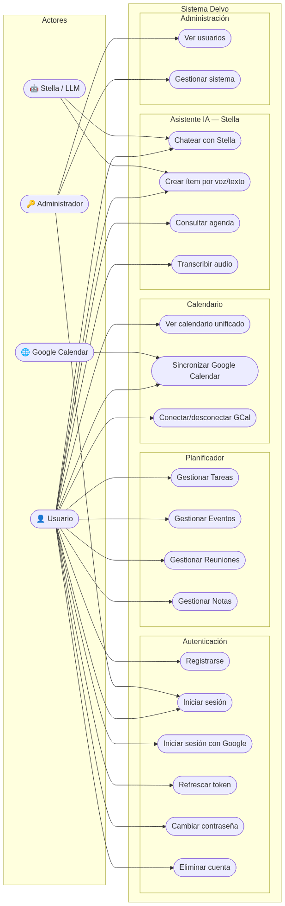
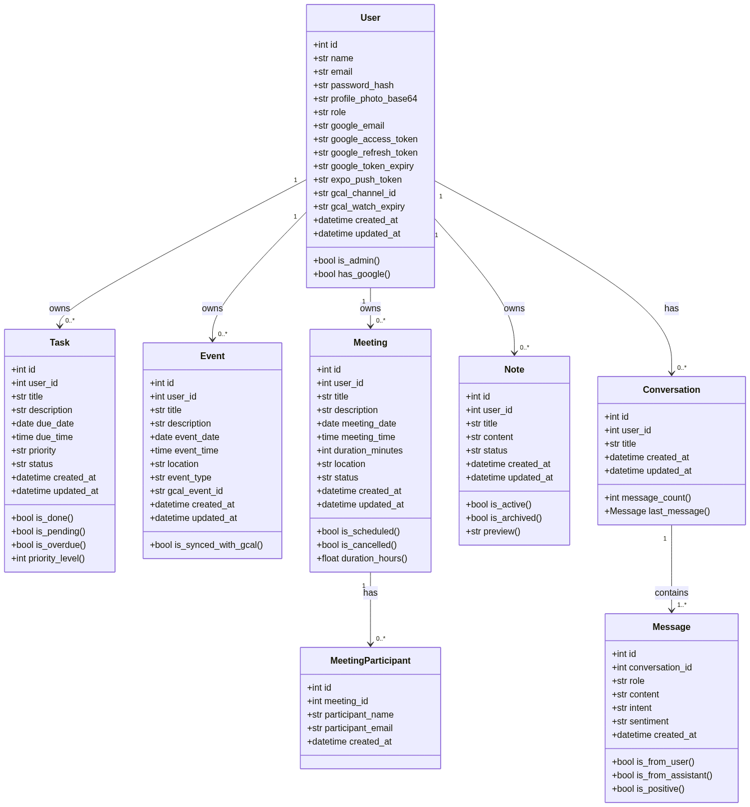
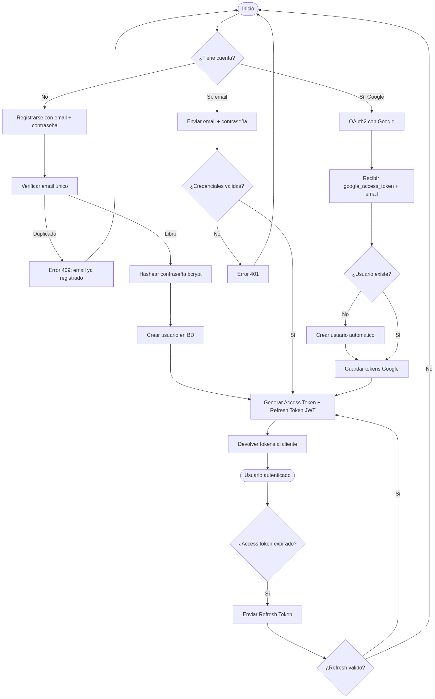
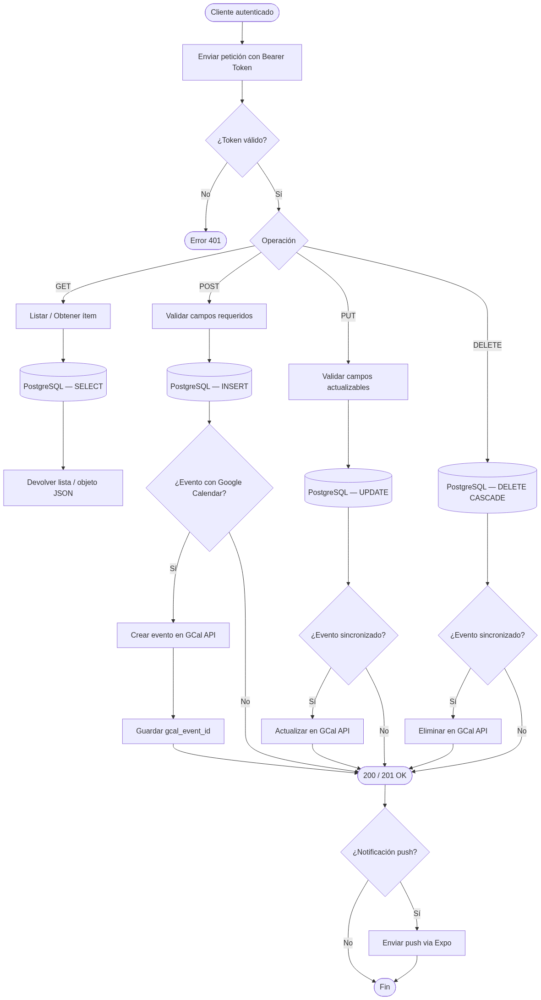
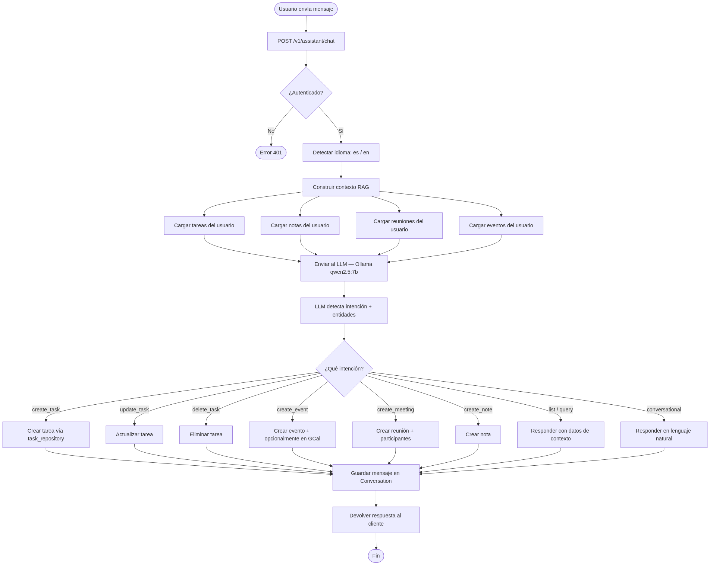
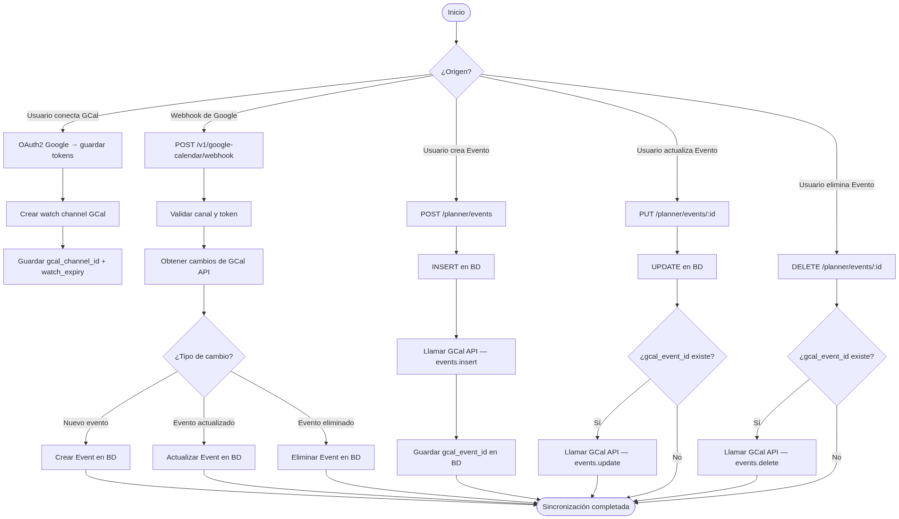
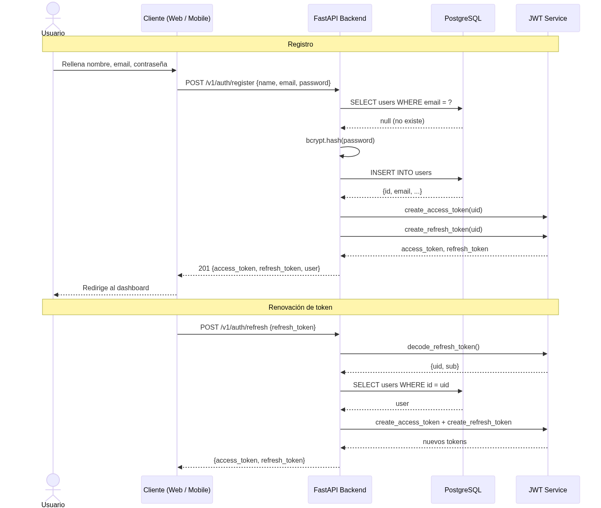
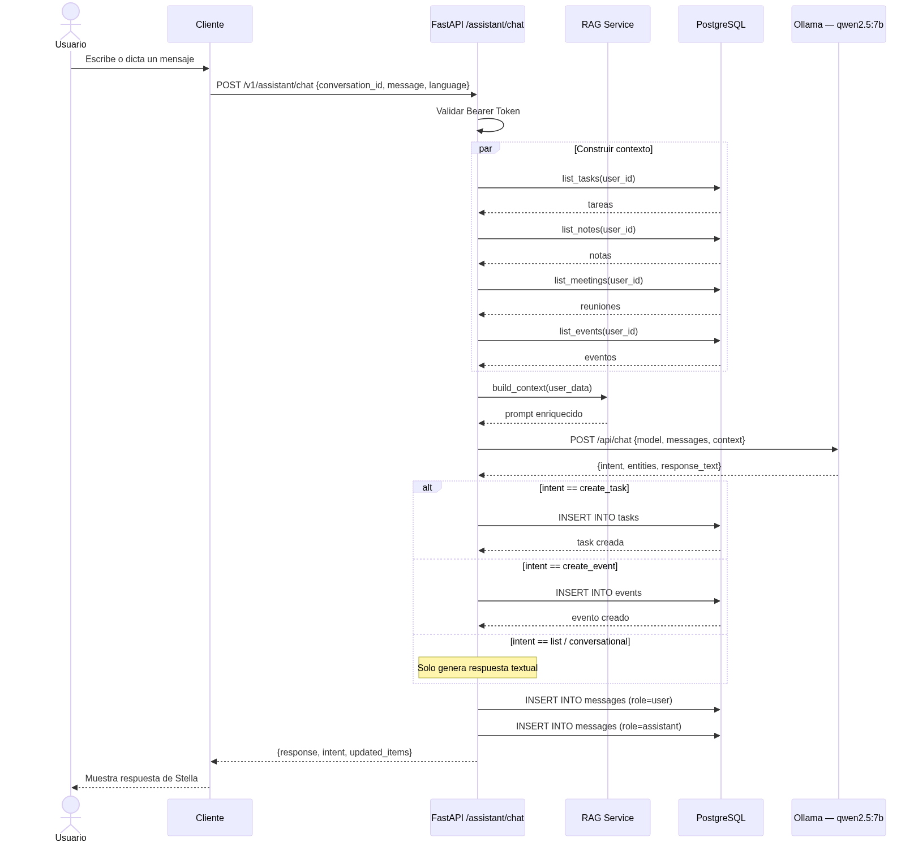
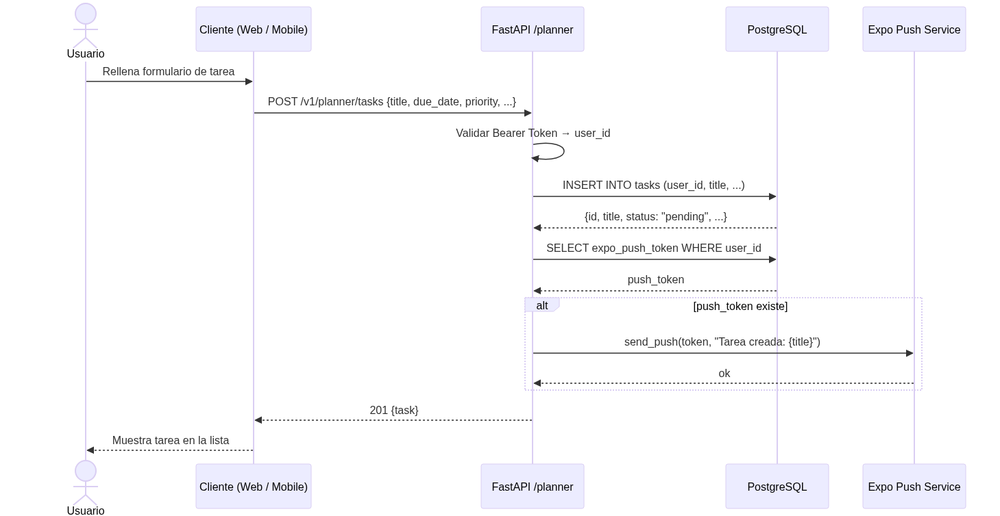
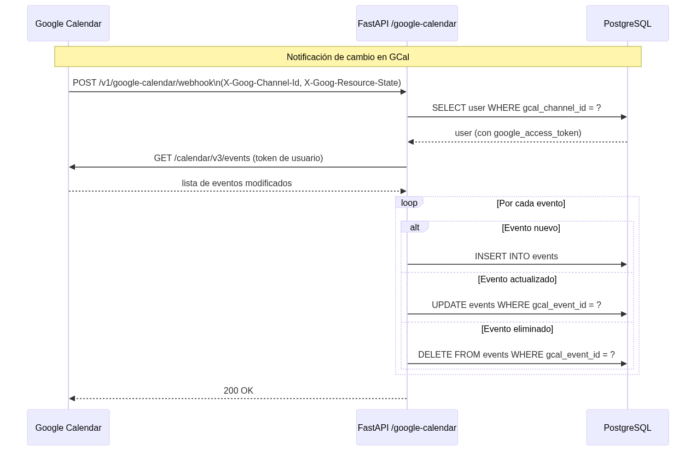

# Diagramas UML — Delvo

## 1. Diagrama de Casos de Uso

---

## 2. Diagrama de Clases

---

## 3. Diagramas de Flujo / Actividad

### 3.1 Flujo de Autenticación

### 3.2 Flujo CRUD del Planificador

### 3.3 Flujo del Asistente IA — Stella

### 3.4 Flujo de Sincronización con Google Calendar

---

## 4. Diagramas de Secuencia

### 4.1 Secuencia: Registro e Inicio de Sesión

### 4.2 Secuencia: Chat con Stella (Asistente IA)

### 4.3 Secuencia: Crear Tarea desde el Planificador

### 4.4 Secuencia: Sincronización Webhook de Google Calendar

